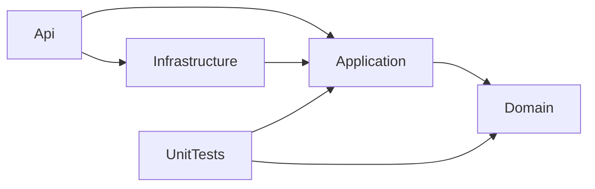
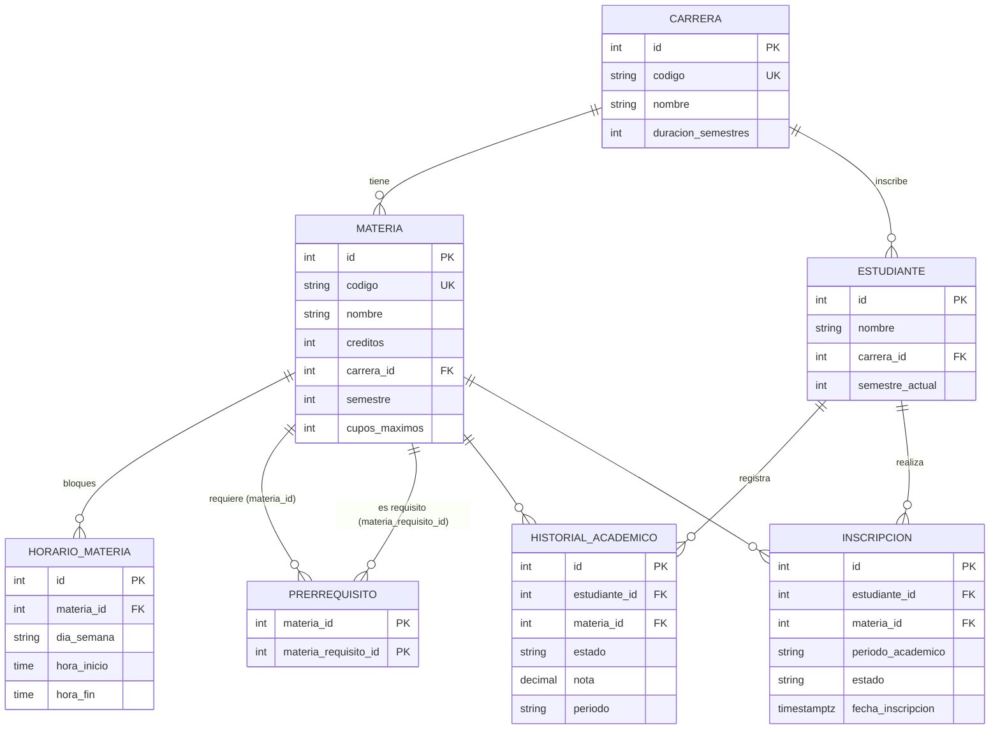
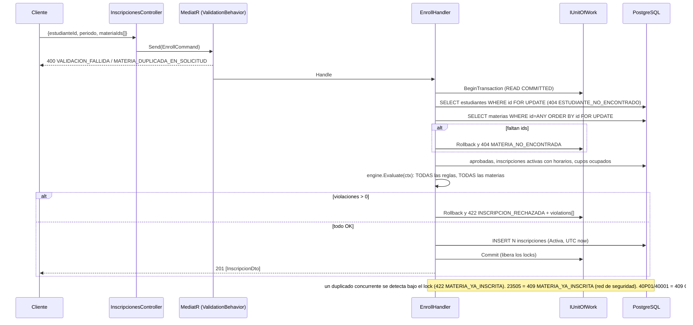

# MsInscripcion - Microservicio de inscripción de materias

Microservicio en **.NET 8 (C#)** para la inscripción de materias universitarias. Expone una API REST (ASP.NET Core con controllers) sobre **PostgreSQL** con EF Core, organizada en Clean Architecture (Domain, Application, Infrastructure, Api), con MediatR (CQRS), FluentValidation, Serilog y Swagger.

Lo más importante del servicio:

- La inscripción (`POST /api/inscripciones`) es **atómica**: si una sola materia incumple una regla, no se inscribe ninguna.
- Devuelve **todas** las violaciones de una vez, indicando qué materia causó cada una.
- Los cupos y los cruces de horario son seguros ante concurrencia (bloqueo pesimista `FOR UPDATE` del estudiante y luego de las materias, dentro de una transacción).
- Errores en formato **ProblemDetails (RFC 7807)** con códigos explícitos y mensajes en español.

## Tabla de contenidos

1. [Estructura de la solución](#estructura-de-la-solución)
2. [Modelo de datos (ER)](#modelo-de-datos-er)
3. [Decisiones de arquitectura](#decisiones-de-arquitectura)
4. [Reglas de negocio y códigos de error](#reglas-de-negocio-y-códigos-de-error)
5. [Cómo ejecutar](#cómo-ejecutar)
6. [Configuración](#configuración)
7. [Datos semilla](#datos-semilla)
8. [Ejemplos con curl](#ejemplos-con-curl)
9. [Supuestos](#supuestos)

## Estructura de la solución

```
MsInscripcion.sln
Directory.Build.props        net8.0, Nullable, ImplicitUsings, RollForward=Major
Directory.Packages.props     Central Package Management (todas las versiones en un solo archivo)
.config/dotnet-tools.json    dotnet-ef 8.0.11
Dockerfile, docker-compose.yml, .dockerignore
src/
  MsInscripcion.Domain/          Entities/, Enums/, Rules/ (6 reglas + engine + contexto), Services/PrerequisiteGraph, Exceptions/
  MsInscripcion.Application/     Abstractions/Persistence/, Common/ (Behaviors, Exceptions, Options), Features/{Inscripciones,Carreras,Materias,Horarios,Prerrequisitos}
  MsInscripcion.Infrastructure/  Persistence/ (DbContext, Configurations/, Repositories/, UnitOfWork, Migrations/, Seed/)
  MsInscripcion.Api/             Controllers/, Middleware/, Json/, Program.cs, appsettings*.json
tests/
  MsInscripcion.UnitTests/       Rules/, Engine/, Services/, Fixtures/
```

Dependencias entre proyectos (la flecha apunta a lo que se referencia):



El Domain no depende de ningún paquete: las reglas son funciones puras sobre un `EnrollmentContext`.

## Modelo de datos (ER)



Restricciones relevantes:

- Los enums se guardan como texto (`Aprobada`, `Activa`, `Lunes`, ...).
- Checks: `hora_inicio < hora_fin` y `materia_id <> materia_requisito_id`.
- Índice único en historial: `(estudiante_id, materia_id, periodo)`.
- **Índice único parcial** `ux_inscripciones_activa` sobre `(estudiante_id, materia_id, periodo_academico) WHERE estado = 'Activa'`: la red de seguridad contra duplicados en carreras de concurrencia.
- FKs con `Restrict`, salvo horarios y prerrequisitos, que hacen `Cascade` desde la materia.
- Nombres de tablas y columnas en `snake_case` (EFCore.NamingConventions).

### Flujo de `POST /api/inscripciones`



## Decisiones de arquitectura

| # | Decisión | Por qué |
|---|---|---|
| 1 | **Controllers** (`[ApiController]`) en lugar de Minimal APIs | Unos 20 endpoints en 5 recursos: `[ApiController]` da ProblemDetails de binding, `ProducesResponseType` mejora Swagger y es fácil comprobar que no hay lógica en los controllers (solo `mediator.Send`). |
| 2 | **Motor de reglas con patrón Strategy** en Domain | Una regla = una clase (`IEnrollmentRule`). El engine ejecuta las 6 reglas para cada materia **sin cortocircuito** y junta todas las violaciones. Se testea sin mocks ni base de datos. |
| 3 | **Bloqueo pesimista** `SELECT ... FOR UPDATE` sobre el estudiante y luego sobre las materias (ordenadas por id) + índice único parcial | Inscribir nunca modifica la fila de Materia, así que un token `xmin`/RowVersion sobre ella jamás cambiaría. Los cupos se cuentan por (materia, periodo). El lock del estudiante serializa solicitudes concurrentes de la misma persona (evita que dos pedidos con materias distintas que se cruzan pasen R3 a la vez). El orden fijo (estudiante y luego materias por id) evita deadlocks. El índice parcial es una red de seguridad para duplicados. |
| 4 | **Repositorios + Unit of Work** en `Application/Abstractions/Persistence` | Application queda libre de EF Core; el SQL del lock y el mapeo de errores de Postgres (23505, 23503, 40P01, 40001) viven en Infrastructure; los handlers se mockean con Moq. |
| 5 | **CPM** (Central Package Management) | Todas las versiones fijadas en `Directory.Packages.props`. |
| 6 | **Periodo como string** `AAAA-N` (por defecto `^\d{4}-[12]$`) | No hay entidad Periodo; alcanza para filtrar y validar sin más tablas. |
| 7 | **Semilla con `HasData`** dentro de la migración | Determinista, versionada e idempotente; ids fijos y legibles para los ejemplos. Las secuencias de identidad arrancan en 1000. |
| 8 | **ExceptionHandlingMiddleware** propio | Un único lugar construye todos los ProblemDetails; sin filtrar internos en errores 500. |
| 9 | **Horas en formato `HH:mm`** (converter propio + `MapType<TimeOnly>` en Swagger) | Contrato claro y Swagger correcto. |
| 10 | **`RollForward=Major`** en todos los proyectos | Permite ejecutar tests y `dotnet-ef` en máquinas con solo .NET 10; es inocuo en las imágenes 8.0. |

## Reglas de negocio y códigos de error

### Reglas de inscripción (cada una devuelve una violación por materia que la incumple)

| Regla | Código | Cuándo se viola |
|---|---|---|
| R1 Carrera | `CARRERA_NO_CORRESPONDE` | La materia es de otra carrera que la del estudiante. |
| R2 Prerrequisitos | `PREREQUISITO_NO_CUMPLIDO` | Algún prerrequisito no está `Aprobada` en el historial (`details.missing` lista los códigos). |
| R3 Cruce de horarios | `CRUCE_HORARIO` | Mismo día y rangos que se intersectan con una inscripción activa del periodo o con una materia **anterior** de la misma solicitud (`details.conflictsWith`). Intervalos semiabiertos: 08-10 y 10-12 NO se cruzan. |
| R4 Límite de semestres | `SEMESTRE_EXCEDIDO` | `materia.Semestre > SemestreActual + MaxSemestersAhead`. |
| R5 No duplicidad | `MATERIA_YA_APROBADA` / `MATERIA_YA_INSCRITA` | Ya aprobada, o ya inscrita (Activa) en el periodo. |
| R6 Cupos | `CUPO_AGOTADO` | Inscripciones activas del periodo >= `CuposMaximos`. |

### Otros códigos de error (ProblemDetails)

| HTTP | `code` | Origen |
|---|---|---|
| 400 | `VALIDACION_FALLIDA` | Validación FluentValidation o body/modelo inválido (`errors{}` con el detalle por campo). |
| 400 | `MATERIA_DUPLICADA_EN_SOLICITUD` | `materiaIds` con ids repetidos. |
| 404 | `ESTUDIANTE_NO_ENCONTRADO`, `MATERIA_NO_ENCONTRADA`, `INSCRIPCION_NO_ENCONTRADA`, `CARRERA_NO_ENCONTRADA`, `HORARIO_NO_ENCONTRADO`, `PRERREQUISITO_NO_ENCONTRADO` | Recurso inexistente. |
| 409 | `INSCRIPCION_YA_CANCELADA` | DELETE sobre una inscripción ya cancelada. |
| 409 | `CODIGO_DUPLICADO`, `PRERREQUISITO_DUPLICADO` | Unicidad en el CRUD. |
| 409 | `ENTIDAD_EN_USO` | Borrar algo referenciado (FK, 23503). |
| 409 | `MATERIA_YA_INSCRITA` | Red de seguridad: 23505 sobre `ux_inscripciones_activa`. Normalmente un duplicado concurrente se detecta bajo el lock y responde 422 `INSCRIPCION_RECHAZADA` con la violación `MATERIA_YA_INSCRITA`. |
| 409 | `CONFLICTO_CONCURRENCIA` | Deadlock / fallo de serialización (40P01, 40001): reintentar. |
| 422 | `INSCRIPCION_RECHAZADA` | Una o más reglas R1-R6 incumplidas; incluye `violations[]`. |
| 422 | `PRERREQUISITO_CICLICO`, `HORARIO_INVALIDO` | Invariantes de dominio en el CRUD. |
| 500 | `ERROR_INTERNO` | Error no controlado (se registra en Serilog, sin filtrar internos). |

Todas las respuestas de error incluyen `type, title, status, detail, instance` más las extensiones `code` y `traceId`.

## Cómo ejecutar

### Con Docker (recomendado)

Requiere Docker con Compose.

```bash
docker compose up --build
```

- La API queda en **http://localhost:8080** y Swagger UI en **http://localhost:8080/swagger** (el compose corre en `Production` con `Swagger__Enabled=true`).
- PostgreSQL 16 en `localhost:5432` (usuario/clave `postgres`/`postgres`, base `inscripcion`), con volumen nombrado `pgdata`.
- La API espera a que la base esté sana (`pg_isready`), aplica las migraciones y carga la semilla al arrancar.
- Para empezar de cero: `docker compose down -v`.
- Si los puertos están ocupados, cambialos con `API_PORT` y `DB_PORT`: `API_PORT=8081 docker compose up --build`.

### Pruebas E2E de todos los endpoints

`scripts/e2e.sh` ejecuta 73 chequeos sobre los 20 endpoints: camino feliz, errores de negocio, validaciones, atomicidad, dos carreras concurrentes (mismo estudiante con materias que se cruzan y último cupo) y los errores del framework en formato ProblemDetails. Necesita la semilla limpia porque cada paso modifica el estado:

```bash
docker compose down -v && docker compose up --build -d
PORT=8080 bash scripts/e2e.sh   # termina con "TOTAL: N passed, M failed"
```

### Colección de Postman

`postman/` tiene las mismas pruebas como colección de Postman: 65 requests en 10 carpetas, con asserts en cada request y un chequeo global de que todo error sea `application/problem+json` con `code` y `traceId`.

- **Postman:** importá `postman/MsInscripcion.postman_collection.json` y `postman/MsInscripcion.local.postman_environment.json`, elegí el environment *MsInscripcion - local* (ajustá `host` si usás otro puerto) y ejecutá la colección **en orden** con el Collection Runner, sobre la semilla limpia.
- **Newman (CLI/CI):**

```bash
npx newman run postman/MsInscripcion.postman_collection.json \
  -e postman/MsInscripcion.local.postman_environment.json \
  --env-var host=http://localhost:8080
```

Las pruebas de concurrencia disparan dos `pm.sendRequest` en paralelo desde el script de tests, porque el Runner ejecuta los requests de uno en uno.

### Local con `dotnet run`

Necesitás una PostgreSQL accesible con la cadena de `appsettings.json` (por defecto `localhost:5432`, base `inscripcion`, `postgres`/`postgres`). Por ejemplo, solo la base con Docker:

```bash
docker compose up -d db
dotnet run --project src/MsInscripcion.Api
```

Los proyectos apuntan a `net8.0` pero `Directory.Build.props` fija `RollForward=Major`, así que funcionan aunque la máquina tenga solo el runtime de .NET 10. En `Development` Swagger está en `/swagger` (el puerto lo muestra la consola al arrancar).

### Tests unitarios

```bash
dotnet test tests/MsInscripcion.UnitTests
```

### Migraciones

La migración inicial (`InitialCreate`, incluye la semilla) vive en `src/MsInscripcion.Infrastructure/Persistence/Migrations`. Para regenerar o crear nuevas:

```bash
dotnet tool restore
DOTNET_ROLL_FORWARD=Major dotnet ef migrations add NombreMigracion \
  -p src/MsInscripcion.Infrastructure -s src/MsInscripcion.Api
```

`DOTNET_ROLL_FORWARD=Major` es necesario solo si tenés únicamente .NET 10 instalado (la herramienta `dotnet-ef` 8.0.11 corre sobre runtime 8). Cambiar la semilla requiere una migración nueva (`HasData`).

## Configuración

Todo es sobreescribible con variables de entorno (`__` como separador de secciones).

| Clave | Variable de entorno | Valor por defecto | Descripción |
|---|---|---|---|
| `ConnectionStrings:Default` | `ConnectionStrings__Default` | `Host=localhost;Port=5432;Database=inscripcion;Username=postgres;Password=postgres` | Cadena de conexión a PostgreSQL. |
| `Enrollment:MaxSemestersAhead` | `Enrollment__MaxSemestersAhead` | `3` | X de la regla R4 (semestre máximo = SemestreActual + X). Debe ser >= 0. |
| `Enrollment:CurrentPeriod` | `Enrollment__CurrentPeriod` | `2026-2` | Periodo por defecto en las consultas. Formato `^\d{4}-[12]$`; se valida al arrancar. |
| `Database:ApplyMigrationsOnStartup` | `Database__ApplyMigrationsOnStartup` | `true` | Aplica migraciones (y semilla) al iniciar. |
| `Serilog:*` | `Serilog__MinimumLevel__Default` | `Information` | Logging por consola. |
| `Swagger:Enabled` | `Swagger__Enabled` | `true` solo en `Development` (compose: `true`) | Habilita Swagger UI en `/swagger`, independiente del entorno. |
| - | `ASPNETCORE_ENVIRONMENT` | (compose: `Production`) | Entorno de ASP.NET Core. |
| - | `ASPNETCORE_URLS` | `http://+:8080` en la imagen | Puerto de escucha. |

## Datos semilla

Periodo de demostración: **2026-2**. Las secuencias de identidad arrancan en **1000**, así que los registros nuevos nunca chocan con la semilla.

**Carreras**

| Id | Código | Nombre | Semestres |
|---|---|---|---|
| 1 | ING-SIS | Ingeniería de Sistemas | 10 |
| 2 | ADM | Administración de Empresas | 8 |

**Estudiantes**

| Id | Nombre | Carrera | Semestre actual | Historial | Inscripciones activas 2026-2 |
|---|---|---|---|---|---|
| 1 | Ana | 1 (ING-SIS) | 2 | MAT101 Aprobada, PRG101 Aprobada, FIS101 Reprobada (2026-1) | Inscripción 1: ETI101 |
| 2 | Carlos | 1 (ING-SIS) | 1 | - | Inscripción 2: ALG201 (ocupa el único cupo) |

Con `MaxSemestersAhead=3`, Ana puede inscribir hasta el semestre 5.

**Materias** (todas de la carrera 1, salvo ADM101)

| Id | Código | Nombre | Sem | Cupos | Horario | Prerrequisito |
|---|---|---|---|---|---|---|
| 1 | MAT101 | Cálculo I | 1 | 30 | Lun 06-08, Mié 06-08 | - |
| 2 | FIS101 | Física I | 1 | 30 | Lun 09-11 | - |
| 3 | PRG101 | Programación I | 1 | 30 | Mar 08-10 | - |
| 4 | ETI101 | Ética | 1 | 30 | Vie 08-10 | - |
| 5 | HUM101 | Humanidades | 1 | 30 | Vie 09-11 | - |
| 6 | MAT201 | Cálculo II | 2 | 30 | Lun 08-10, Mié 10-12 | MAT101 |
| 7 | PRG201 | Programación II | 2 | 30 | Mar 10-12, Jue 10-12 | PRG101 |
| 8 | EST201 | Estadística | 2 | 30 | Mar 12-14 | - |
| 9 | ALG201 | Álgebra Lineal | 2 | **1** | Jue 14-16 | - |
| 10 | EDD301 | Estructuras de Datos | 3 | 30 | Mié 14-16 | PRG201 |
| 11 | ING601 | Ingeniería de Software | 6 | 30 | Jue 16-18 | - |
| 12 | ADM101 | Contabilidad (**carrera 2**) | 1 | 30 | Sáb 08-10 | - |

Qué permite probar cada una con Ana: MAT101 (`MATERIA_YA_APROBADA`), FIS101 (recursar tras reprobar es válido; cruza con MAT201 en Lunes), ETI101 (`MATERIA_YA_INSCRITA`), HUM101 (`CRUCE_HORARIO` con la ETI101 ya inscrita), ALG201 (`CUPO_AGOTADO`), EDD301 (`PREREQUISITO_NO_CUMPLIDO`), ING601 (`SEMESTRE_EXCEDIDO`, 6 > 2+3), ADM101 (`CARRERA_NO_CORRESPONDE`). PRG201 (Mar 10-12) y EST201 (Mar 12-14) son consecutivas y **no** se cruzan (intervalos semiabiertos).

## Ejemplos con curl

Los ejemplos usan `http://localhost:8080` y los ids reales de la semilla. Ejecutalos **en este orden** sobre una base recién sembrada (`docker compose down -v` para reiniciar): el camino feliz inscribe a Ana en MAT201, PRG201 y EST201, y luego esas materias ya no darían las mismas violaciones que se muestran abajo.

### 1. Ver el catálogo y la semilla

```bash
# Carreras
curl -s http://localhost:8080/api/carreras

# Catálogo de materias con horarios y prerrequisitos (filtros opcionales)
curl -s "http://localhost:8080/api/materias?carreraId=1&semestre=2"
```

Ejemplo de un elemento del catálogo (horas en `HH:mm`, días como texto):

```json
{
  "id": 6, "codigo": "MAT201", "nombre": "Cálculo II", "creditos": 4,
  "carreraId": 1, "semestre": 2, "cuposMaximos": 30,
  "horarios": [
    { "id": 7, "materiaId": 6, "diaSemana": "Lunes", "horaInicio": "08:00", "horaFin": "10:00" },
    { "id": 8, "materiaId": 6, "diaSemana": "Miercoles", "horaInicio": "10:00", "horaFin": "12:00" }
  ],
  "prerrequisitoIds": [1]
}
```

### 2. Materias disponibles para Ana (informativo, sin bloqueo)

```bash
curl -s http://localhost:8080/api/estudiantes/1/materias-disponibles
```

Con la semilla devuelve FIS101, MAT201, PRG201 y EST201 (ids 2, 6, 7 y 8). Quedan fuera: MAT101/PRG101 (aprobadas), ETI101 (ya inscrita), HUM101 (cruce con ETI101), ALG201 (sin cupo), EDD301 (falta PRG201), ING601 (semestre excedido). Cada materia se evalúa por separado; el resultado es orientativo y no reserva cupo.

### 3. Todas las violaciones a la vez (422)

Ana pide `[1,2,6,4,9,10,11,12]`:

```bash
curl -s -i -X POST http://localhost:8080/api/inscripciones \
  -H "Content-Type: application/json" \
  -d '{"estudianteId":1,"periodo":"2026-2","materiaIds":[1,2,6,4,9,10,11,12]}'
```

Resultado: **7 violaciones**, una en cada una de MAT101, MAT201, ETI101, ALG201, EDD301, ING601 y ADM101. FIS101 no tiene violaciones (recursar es válido y no cruza con MAT101). El cruce se reporta sobre MAT201 (aparece después de FIS101 en la solicitud y ambas caen el lunes: 08-10 vs 09-11). ING601 (Jue 16-18) no cruza con ALG201 (Jue 14-16) por los intervalos semiabiertos. No se inscribe nada.

```json
{
  "type": "https://httpstatuses.io/422",
  "title": "Inscripción rechazada",
  "status": 422,
  "detail": "La inscripción fue rechazada por incumplir una o más reglas de negocio.",
  "instance": "/api/inscripciones",
  "code": "INSCRIPCION_RECHAZADA",
  "violations": [
    { "code": "MATERIA_YA_APROBADA", "materiaId": 1, "materiaCodigo": "MAT101",
      "message": "La materia MAT101 ya fue aprobada por el estudiante.", "details": null },
    { "code": "CRUCE_HORARIO", "materiaId": 6, "materiaCodigo": "MAT201",
      "message": "La materia MAT201 tiene cruce de horario con FIS101.",
      "details": { "conflictsWith": "FIS101", "conflictsWithMateriaId": 2 } },
    { "code": "MATERIA_YA_INSCRITA", "materiaId": 4, "materiaCodigo": "ETI101",
      "message": "El estudiante ya está inscrito en la materia ETI101 para el periodo 2026-2.", "details": null },
    { "code": "CUPO_AGOTADO", "materiaId": 9, "materiaCodigo": "ALG201",
      "message": "La materia ALG201 no tiene cupos disponibles.",
      "details": { "cuposMaximos": 1, "inscritos": 1 } },
    { "code": "PREREQUISITO_NO_CUMPLIDO", "materiaId": 10, "materiaCodigo": "EDD301",
      "message": "La materia EDD301 requiere aprobar: PRG201.",
      "details": { "missing": ["PRG201"], "missingIds": [7] } },
    { "code": "SEMESTRE_EXCEDIDO", "materiaId": 11, "materiaCodigo": "ING601",
      "message": "La materia ING601 es del semestre 6, y el máximo permitido para el estudiante es 5.",
      "details": { "materiaSemestre": 6, "maxAllowedSemestre": 5 } },
    { "code": "CARRERA_NO_CORRESPONDE", "materiaId": 12, "materiaCodigo": "ADM101",
      "message": "La materia ADM101 no pertenece a la carrera del estudiante.", "details": null }
  ],
  "traceId": "00-4bf92f3577b34da6a3ce929d0e0e4736-00f067aa0ba902b7-00"
}
```

### 4. Cruce de horario con una inscripción existente

HUM101 (Vie 09-11) contra la ETI101 ya inscrita de Ana (Vie 08-10):

```bash
curl -s -X POST http://localhost:8080/api/inscripciones \
  -H "Content-Type: application/json" \
  -d '{"estudianteId":1,"periodo":"2026-2","materiaIds":[5]}'
```

Devuelve 422 `INSCRIPCION_RECHAZADA` con una única violación `CRUCE_HORARIO` sobre HUM101 y `details.conflictsWith = "ETI101"`.

### 5. Camino feliz (201)

MAT201 (prerrequisito MAT101 aprobado), PRG201 (prerrequisito PRG101 aprobado) y EST201; sin cruces entre sí ni con ETI101:

```bash
curl -s -i -X POST http://localhost:8080/api/inscripciones \
  -H "Content-Type: application/json" \
  -d '{"estudianteId":1,"periodo":"2026-2","materiaIds":[6,7,8]}'
```

Devuelve `201 Created` con una lista de `InscripcionDto` (ids nuevos desde 1000, estado `Activa`, con la materia y sus horarios):

```json
[
  { "id": 1000, "estudianteId": 1, "materiaId": 6, "periodoAcademico": "2026-2", "estado": "Activa",
    "fechaInscripcion": "2026-09-29T15:04:05+00:00",
    "materia": { "id": 6, "codigo": "MAT201", "nombre": "Cálculo II", "creditos": 4, "semestre": 2, "horarios": [ ... ] } },
  { "id": 1001, "...": "PRG201" },
  { "id": 1002, "...": "EST201" }
]
```

### 6. Inscripciones de un estudiante

```bash
# Periodo por defecto (Enrollment:CurrentPeriod)
curl -s http://localhost:8080/api/estudiantes/1/inscripciones

# Periodo explícito
curl -s "http://localhost:8080/api/estudiantes/1/inscripciones?periodo=2026-2"
```

Devuelve solo las inscripciones **Activas** del periodo, con horarios. Después del camino feliz, Ana tiene ETI101, MAT201, PRG201 y EST201.

### 7. Cancelar y liberar un cupo

Carlos (inscripción 2) ocupa el único cupo de ALG201. Se cancela y el cupo se libera:

```bash
curl -s -i -X DELETE http://localhost:8080/api/inscripciones/2      # 204 No Content
curl -s -i -X DELETE http://localhost:8080/api/inscripciones/2      # 409 INSCRIPCION_YA_CANCELADA

# Ahora Ana sí puede tomar ALG201 (Jue 14-16, sin cruces con lo ya inscrito)
curl -s -i -X POST http://localhost:8080/api/inscripciones \
  -H "Content-Type: application/json" \
  -d '{"estudianteId":1,"periodo":"2026-2","materiaIds":[9]}'      # 201 Created
```

La cancelación es lógica (`estado = Cancelada`); los cupos se cuentan solo desde inscripciones `Activa`.

### 8. Ejemplos de CRUD

```bash
# Crear una carrera
curl -s -X POST http://localhost:8080/api/carreras \
  -H "Content-Type: application/json" \
  -d '{"codigo":"DER","nombre":"Derecho","duracionSemestres":10}'

# Crear una materia (semestre 1 de la carrera 1)
curl -s -X POST http://localhost:8080/api/materias \
  -H "Content-Type: application/json" \
  -d '{"codigo":"LOG101","nombre":"Lógica","creditos":3,"carreraId":1,"semestre":1,"cuposMaximos":25}'

# Agregar un horario a una materia (horas HH:mm; días: Lunes, Martes, Miercoles, Jueves, Viernes, Sabado, Domingo)
curl -s -X POST http://localhost:8080/api/materias/6/horarios \
  -H "Content-Type: application/json" \
  -d '{"diaSemana":"Viernes","horaInicio":"14:00","horaFin":"16:00"}'

# Agregar un prerrequisito (EDD301 requiere además MAT101)
curl -s -X POST http://localhost:8080/api/materias/10/prerrequisitos \
  -H "Content-Type: application/json" \
  -d '{"materiaRequisitoId":1}'

# Un ciclo se rechaza con 422 PRERREQUISITO_CICLICO (MAT201 requiere MAT101; MAT101 no puede requerir MAT201)
curl -s -X POST http://localhost:8080/api/materias/1/prerrequisitos \
  -H "Content-Type: application/json" \
  -d '{"materiaRequisitoId":6}'
```

Otros endpoints CRUD: `GET/PUT/DELETE /api/carreras/{id}`, `GET/PUT/DELETE /api/materias/{id}`, `GET /api/materias/{id}/horarios`, `PUT/DELETE /api/materias/{id}/horarios/{horarioId}`, `GET /api/materias/{id}/prerrequisitos`, `DELETE /api/materias/{id}/prerrequisitos/{materiaRequisitoId}`. Todo está documentado en Swagger.

## Supuestos

1. Solo cuenta como aprobada una materia con estado `Aprobada`; `Cursando` **no** se considera aprobada (no satisface prerrequisitos ni bloquea por R5).
2. Una materia `Reprobada` puede volver a inscribirse; una inscripción `Cancelada` se ignora en todas las reglas (duplicidad, cupos y cruces) y también permite reinscribirse.
3. Los intervalos horarios son semiabiertos: `[inicio, fin)`. Dos bloques consecutivos (10:00-12:00 y 12:00-14:00) no se cruzan.
4. El periodo académico es un string `AAAA-N` (N = 1 o 2, patrón por defecto `^\d{4}-[12]$`); el periodo por defecto sale de `Enrollment:CurrentPeriod`. No existe una entidad Periodo.
5. Ante un cruce entre materias de la misma solicitud, la violación se reporta sobre la materia que aparece **después** en `materiaIds`.
6. La información de cupos de `materias-disponibles` es solo orientativa: se calcula sin bloqueo y no reserva nada; la garantía real está en el `POST` (lock + transacción).
7. Si dos solicitudes concurrentes inscriben a la misma persona en la misma materia, se serializan por el lock del estudiante: la perdedora ve la inscripción de la ganadora y recibe normalmente `422 INSCRIPCION_RECHAZADA` con la violación `MATERIA_YA_INSCRITA`. El `409 MATERIA_YA_INSCRITA` (índice único parcial, 23505) queda como red de seguridad defensiva.
8. Los deadlocks o fallos de serialización se informan como `409 CONFLICTO_CONCURRENCIA` y el cliente puede reintentar.
9. Sin autenticación ni autorización (fuera de alcance).
10. Los proyectos apuntan a `net8.0` con `RollForward=Major` para poder ejecutarse en máquinas que solo tienen .NET 10; en las imágenes Docker 8.0 no tiene efecto.
