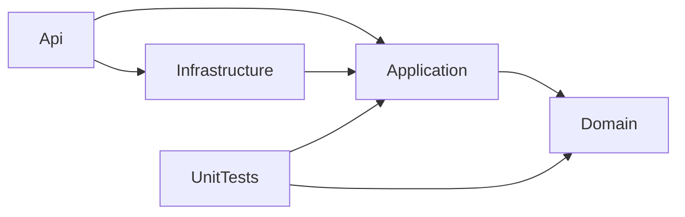
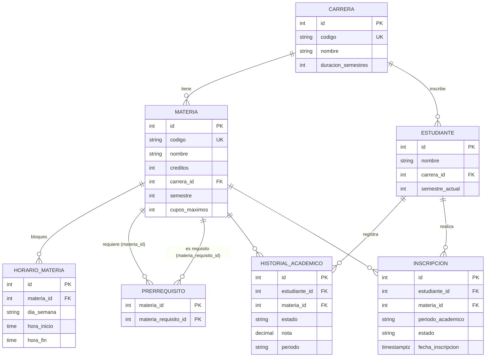

# MsInscripcion - Microservicio de inscripción de materias

Microservicio en **.NET 8 (C#)** para la inscripción de materias universitarias. Expone una API REST (ASP.NET Core con controllers) sobre **PostgreSQL** con EF Core, organizada en Clean Architecture (Domain, Application, Infrastructure, Api), con MediatR (CQRS), FluentValidation, Serilog y Swagger.

Lo más importante del servicio:

- La inscripción (`POST /api/inscripciones`) es **atómica**: si una sola materia incumple una regla, no se inscribe ninguna.
- Devuelve **todas** las violaciones de una vez, indicando qué materia causó cada una.
- Regla de carga **N + máx. 3 compartido**: todo el semestre actual (N) más hasta 3 materias "extra" (adeudadas + semestre N+1), con prerrequisitos estrictos.
- `GET /api/estudiantes/{id}/sugerencia` calcula la carga sugerida con **exactamente las mismas reglas** que luego aplica el `POST` (mismo motor, sin lógica duplicada).
- Los cupos y los cruces de horario son seguros ante concurrencia (bloqueo pesimista `FOR UPDATE` del estudiante y luego de las materias, dentro de una transacción).
- Errores en formato **ProblemDetails (RFC 7807)** con códigos explícitos y mensajes en español.

## Tabla de contenidos

1. [Estructura de la solución](#estructura-de-la-solución)
2. [Modelo de datos (ER)](#modelo-de-datos-er)
3. [Decisiones de arquitectura](#decisiones-de-arquitectura)
4. [Reglas de negocio y códigos de error](#reglas-de-negocio-y-códigos-de-error)
5. [Cómo ejecutar](#cómo-ejecutar)
6. [Configuración](#configuración)
7. [Datos semilla](#datos-semilla)
8. [Ejemplos con curl](#ejemplos-con-curl)
9. [Supuestos](#supuestos)

## Estructura de la solución

```
MsInscripcion.sln
Directory.Build.props        net8.0, Nullable, ImplicitUsings, RollForward=Major
Directory.Packages.props     Central Package Management (todas las versiones en un solo archivo)
.config/dotnet-tools.json    dotnet-ef 8.0.11
Dockerfile, docker-compose.yml, .dockerignore
src/
  MsInscripcion.Domain/          Entities/, Enums/, Rules/ (7 reglas + engine + contexto), Services/{PrerequisiteGraph,EnrollmentSuggestionCalculator}, Exceptions/
  MsInscripcion.Application/     Abstractions/Persistence/, Common/ (Behaviors, Exceptions, Options), Features/{Inscripciones,Sugerencia,Carreras,Materias,Horarios,Prerrequisitos}
  MsInscripcion.Infrastructure/  Persistence/ (DbContext, Configurations/, Repositories/, UnitOfWork, Migrations/, Seed/)
  MsInscripcion.Api/             Controllers/, Middleware/, Json/, Program.cs, appsettings*.json
tests/
  MsInscripcion.UnitTests/       Rules/, Engine/, Services/, Handlers/, Seed/, Fixtures/
```

Dependencias entre proyectos (la flecha apunta a lo que se referencia):



El Domain no depende de ningún paquete: las reglas son funciones puras sobre un `EnrollmentContext`.

## Modelo de datos (ER)



Restricciones relevantes:

- Los enums se guardan como texto (`Aprobada`, `Activa`, `Lunes`, ...).
- Checks: `hora_inicio < hora_fin` y `materia_id <> materia_requisito_id`.
- Índice único en historial: `(estudiante_id, materia_id, periodo)`.
- **Índice único parcial** `ux_inscripciones_activa` sobre `(estudiante_id, materia_id, periodo_academico) WHERE estado = 'Activa'`: la red de seguridad contra duplicados en carreras de concurrencia.
- FKs con `Restrict`, salvo horarios y prerrequisitos, que hacen `Cascade` desde la materia.
- Nombres de tablas y columnas en `snake_case` (EFCore.NamingConventions).

### Flujo de `POST /api/inscripciones`

```mermaid
sequenceDiagram
  participant C as Cliente
  participant API as InscripcionesController
  participant M as MediatR (ValidationBehavior)
  participant H as EnrollHandler
  participant UoW as IUnitOfWork
  participant DB as PostgreSQL
  C->>API: {estudianteId, periodo, materiaIds[] | codigosMaterias[]}
  API->>M: Send(EnrollCommand)
  M-->>C: 400 VALIDACION_FALLIDA (XOR materiaIds/codigosMaterias) / MATERIA_DUPLICADA_EN_SOLICITUD
  M->>H: Handle
  opt codigosMaterias
    H->>DB: SELECT id, codigo WHERE codigo IN (...) (sin lock; desconocidos = 404 MATERIA_NO_ENCONTRADA)
  end
  H->>UoW: BeginTransaction (READ COMMITTED)
  H->>DB: SELECT estudiantes WHERE id FOR UPDATE (404 ESTUDIANTE_NO_ENCONTRADO)
  H->>DB: SELECT materias WHERE id=ANY ORDER BY id FOR UPDATE
  alt faltan ids
    H->>UoW: Rollback y 404 MATERIA_NO_ENCONTRADA
  end
  H->>DB: aprobadas, inscripciones activas con horarios, cupos ocupados
  H->>H: engine.Evaluate(ctx): TODAS las reglas (ventana N+1, tope compartido, prerrequisitos, cruce, cupo...), TODAS las materias
  alt violaciones > 0
    H->>UoW: Rollback y 422 INSCRIPCION_RECHAZADA + violations[]
  else todo OK
    H->>DB: INSERT N inscripciones (Activa, UTC now)
    H->>UoW: Commit (libera los locks)
    H-->>C: 201 [InscripcionDto]
  end
  Note over DB,H: un duplicado concurrente se detecta bajo el lock (422 MATERIA_YA_INSCRITA). 23505 = 409 MATERIA_YA_INSCRITA (red de seguridad). 40P01/40001 = 409 CONFLICTO_CONCURRENCIA
```

## Decisiones de arquitectura

| # | Decisión | Por qué |
|---|---|---|
| 1 | **Controllers** (`[ApiController]`) en lugar de Minimal APIs | Unos 21 endpoints en 5 recursos: `[ApiController]` da ProblemDetails de binding, `ProducesResponseType` mejora Swagger y es fácil comprobar que no hay lógica en los controllers (solo `mediator.Send`). |
| 2 | **Motor de reglas con patrón Strategy** en Domain | Una regla = una clase (`IEnrollmentRule`). El engine ejecuta las 7 reglas para cada materia **sin cortocircuito** y junta todas las violaciones. Se testea sin mocks ni base de datos. La regla N+3 son dos Strategies independientes (`SemesterWindowRule` y `ExtraSubjectsCapRule`). |
| 3 | **Bloqueo pesimista** `SELECT ... FOR UPDATE` sobre el estudiante y luego sobre las materias (ordenadas por id) + índice único parcial | Inscribir nunca modifica la fila de Materia, así que un token `xmin`/RowVersion sobre ella jamás cambiaría. Los cupos se cuentan por (materia, periodo). El lock del estudiante serializa solicitudes concurrentes de la misma persona (evita que dos pedidos con materias distintas que se cruzan pasen R3 a la vez). El orden fijo (estudiante y luego materias por id) evita deadlocks. El índice parcial es una red de seguridad para duplicados. |
| 4 | **Repositorios + Unit of Work** en `Application/Abstractions/Persistence` | Application queda libre de EF Core; el SQL del lock y el mapeo de errores de Postgres (23505, 23503, 40P01, 40001) viven en Infrastructure; los handlers se mockean con Moq. |
| 5 | **CPM** (Central Package Management) | Todas las versiones fijadas en `Directory.Packages.props`. |
| 6 | **Periodo como string** `AAAA-N` (por defecto `^\d{4}-[12]$`) | No hay entidad Periodo; alcanza para filtrar y validar sin más tablas. |
| 7 | **Semilla con `HasData`** dentro de la migración | Determinista, versionada e idempotente; ids fijos y legibles para los ejemplos. Las secuencias de identidad arrancan en 1000. La semilla es la malla real de Ingeniería de Sistemas de Unillanos (53 materias). |
| 11 | **La sugerencia es un servicio de dominio puro** (`EnrollmentSuggestionCalculator`) que llama al motor de reglas materia por materia | El `POST` y el `GET sugerencia` ejecutan las mismas reglas: el tope, el cruce y el cupo "secuenciales" salen gratis del contexto de candidatas previas. Una fila bloqueada no consume tope ni horario, así que la siguiente elegible ocupa su lugar. |
| 8 | **ExceptionHandlingMiddleware** propio | Un único lugar construye todos los ProblemDetails; sin filtrar internos en errores 500. |
| 9 | **Horas en formato `HH:mm`** (converter propio + `MapType<TimeOnly>` en Swagger) | Contrato claro y Swagger correcto. |
| 10 | **`RollForward=Major`** en todos los proyectos | Permite ejecutar tests y `dotnet-ef` en máquinas con solo .NET 10; es inocuo en las imágenes 8.0. |

## Reglas de negocio y códigos de error

### Regla de carga: N + máx. 3 compartido

Sea **N** el semestre actual del estudiante. Una materia es **extra** si es de su carrera, no está aprobada y es **adeudada** (`Semestre < N`, incluye `Reprobada` y `Cursando`) o del **semestre siguiente** (`Semestre == N+1`).

- **Todo el semestre N** se puede inscribir completo (no consume tope).
- Las **extras comparten un tope de 3** (`Enrollment:MaxNextSemesterSubjects`): adeudadas + N+1 juntas. El tope cuenta las extras **ya inscritas (Activas) en el periodo** más las de la solicitud. Las adeudadas **no son obligatorias**.
- Nada por encima de **N+1** (`SEMESTRE_EXCEDIDO`).
- Los **prerrequisitos son estrictos**: deben estar `Aprobada` en el historial. Pedir en la misma solicitud la materia y su prerrequisito **no** lo satisface.
- Si N es el último semestre de la carrera, no existe N+1 (el tope solo aplica a adeudadas).

### Reglas de inscripción (cada una devuelve una violación por materia que la incumple)

| Regla | Código | Cuándo se viola |
|---|---|---|
| R1 Carrera | `CARRERA_NO_CORRESPONDE` | La materia es de otra carrera que la del estudiante. |
| R2 Prerrequisitos | `PREREQUISITO_NO_CUMPLIDO` | Algún prerrequisito no está `Aprobada` en el historial (`details.missing` lista los códigos). |
| R3 Cruce de horarios | `CRUCE_HORARIO` | Mismo día y rangos que se intersectan con una inscripción activa del periodo o con una materia **anterior** de la misma solicitud (`details.conflictsWith`). Intervalos semiabiertos: 08-10 y 10-12 NO se cruzan. |
| R4 Ventana de semestres | `SEMESTRE_EXCEDIDO` | `materia.Semestre > N + 1` (`details.materiaSemestre`, `details.maxAllowedSemestre`). |
| R4b Tope de extras | `LIMITE_SIGUIENTE_SEMESTRE_EXCEDIDO` | Adeudadas + N+1 (activas + solicitud) superan `MaxNextSemesterSubjects`. En el `POST` se reportan las extras que excedan, en orden de la solicitud (4.ª en adelante); se rechaza la solicitud completa. `details`: `maxExtraSubjects`, `used`. |
| R5 No duplicidad | `MATERIA_YA_APROBADA` / `MATERIA_YA_INSCRITA` | Ya aprobada, o ya inscrita (Activa) en el periodo. |
| R6 Cupos | `CUPO_AGOTADO` | Inscripciones activas del periodo >= `CuposMaximos`. |

> El código y la clave de configuración conservan el nombre `LIMITE_SIGUIENTE_SEMESTRE_EXCEDIDO` / `MaxNextSemesterSubjects` por contrato con el front, aunque el tope cuenta adeudadas **y** N+1.

### Otros códigos de error (ProblemDetails)

| HTTP | `code` | Origen |
|---|---|---|
| 400 | `VALIDACION_FALLIDA` | Validación FluentValidation o body/modelo inválido (`errors{}` con el detalle por campo). Incluye enviar **ambas** listas o **ninguna** (`materiaIds` / `codigosMaterias`) y periodos mal formados. |
| 400 | `MATERIA_DUPLICADA_EN_SOLICITUD` | `materiaIds` o `codigosMaterias` con elementos repetidos. |
| 404 | `ESTUDIANTE_NO_ENCONTRADO`, `MATERIA_NO_ENCONTRADA`, `INSCRIPCION_NO_ENCONTRADA`, `CARRERA_NO_ENCONTRADA`, `HORARIO_NO_ENCONTRADO`, `PRERREQUISITO_NO_ENCONTRADO` | Recurso inexistente (`MATERIA_NO_ENCONTRADA` también para un código de `codigosMaterias` desconocido). |
| 409 | `INSCRIPCION_YA_CANCELADA` | DELETE sobre una inscripción ya cancelada. |
| 409 | `CODIGO_DUPLICADO`, `PRERREQUISITO_DUPLICADO` | Unicidad en el CRUD. |
| 409 | `ENTIDAD_EN_USO` | Borrar algo referenciado (FK, 23503). |
| 409 | `MATERIA_YA_INSCRITA` | Red de seguridad: 23505 sobre `ux_inscripciones_activa`. Normalmente un duplicado concurrente se detecta bajo el lock y responde 422 `INSCRIPCION_RECHAZADA` con la violación `MATERIA_YA_INSCRITA`. |
| 409 | `CONFLICTO_CONCURRENCIA` | Deadlock / fallo de serialización (40P01, 40001): reintentar. |
| 422 | `INSCRIPCION_RECHAZADA` | Una o más reglas incumplidas; incluye `violations[]`. |
| 422 | `PRERREQUISITO_CICLICO`, `HORARIO_INVALIDO` | Invariantes de dominio en el CRUD. |
| 500 | `ERROR_INTERNO` | Error no controlado (se registra en Serilog, sin filtrar internos). |

Todas las respuestas de error incluyen `type, title, status, detail, instance` más las extensiones `code` y `traceId`.

### Endpoint de sugerencia

`GET /api/estudiantes/{id}/sugerencia?periodo=AAAA-N` (periodo opcional, por defecto `Enrollment:CurrentPeriod`) devuelve la carga sugerida. Las materias se evalúan en orden de prioridad (semestre N, luego adeudadas, luego N+1; dentro de cada grupo por código) y una fila entra a la sugerencia solo si pasa **todas** las reglas junto con las ya aceptadas:

- `estado`: `Sugerida` o `Prerrequisito` (contrato de 2 estados del front). Cuando es `Prerrequisito`, `motivo` dice la causa real: `PREREQUISITO_NO_CUMPLIDO`, `CUPO_AGOTADO`, `CRUCE_HORARIO` o `LIMITE_SIGUIENTE_SEMESTRE_EXCEDIDO`; `prerrequisitoCumplido` es `false` solo en el primer caso.
- Una fila bloqueada **no** consume tope ni bloquea horario: la siguiente elegible toma su lugar.
- Se **omiten** las aprobadas, las ya inscritas (`Activa`) en el periodo, las de otra carrera y las `> N+1`.
- `totalCreditos` = suma de créditos de las filas `Sugerida`. `notificaciones` siempre vacío por ahora.
- 400 `VALIDACION_FALLIDA` (periodo mal formado), 404 `ESTUDIANTE_NO_ENCONTRADO`. Es informativo: se calcula sin locks y no reserva cupo.

`GET /api/estudiantes/{id}/materias-disponibles` queda **deprecado** (Swagger lo marca `deprecated`): delega en la sugerencia y devuelve solo las filas `Sugerida` como lista de materias.

## Cómo ejecutar

### Con Docker (recomendado)

Requiere Docker con Compose.

```bash
docker compose up --build
```

- La API queda en **http://localhost:8080** y Swagger UI en **http://localhost:8080/swagger** (el compose corre en `Production` con `Swagger__Enabled=true`).
- PostgreSQL 16 en `localhost:5432` (usuario/clave `postgres`/`postgres`, base `inscripcion`), con volumen nombrado `pgdata`.
- La API espera a que la base esté sana (`pg_isready`), aplica las migraciones y carga la semilla al arrancar.
- Para empezar de cero: `docker compose down -v`.
- Si los puertos están ocupados, cambialos con `API_PORT` y `DB_PORT` (la API usa `API_PORT` en el host y Postgres `DB_PORT`): `API_PORT=8081 DB_PORT=5433 docker compose up --build`. Con puertos distintos, `PORT=8081 bash scripts/e2e.sh` y `--env-var host=http://localhost:8081` en Newman.

### Pruebas E2E de todos los endpoints

`scripts/e2e.sh` ejecuta 145 chequeos sobre los 21 endpoints: la sugerencia de los cinco estudiantes de la semilla, la regla N + máx. 3 (tope, adeudada, activas que cuentan), prerrequisitos estrictos, `codigosMaterias`, camino feliz, validaciones, atomicidad, dos carreras concurrentes (mismo estudiante con materias que se cruzan y último cupo) y los errores del framework en formato ProblemDetails. Necesita la semilla limpia porque cada paso modifica el estado:

```bash
docker compose down -v && docker compose up --build -d
PORT=8080 bash scripts/e2e.sh   # termina con "TOTAL: 145 passed, 0 failed"
```

### Colección de Postman

`postman/` tiene las mismas pruebas como colección de Postman: 98 requests en 11 carpetas (299 asserts con Newman), con asserts en cada request y un chequeo global de que todo error sea `application/problem+json` con `code` y `traceId`.

- **Postman:** importá `postman/MsInscripcion.postman_collection.json` y `postman/MsInscripcion.local.postman_environment.json`, elegí el environment *MsInscripcion - local* (ajustá `host` si usás otro puerto) y ejecutá la colección **en orden** con el Collection Runner, sobre la semilla limpia.
- **Newman (CLI/CI):**

```bash
npx newman run postman/MsInscripcion.postman_collection.json \
  -e postman/MsInscripcion.local.postman_environment.json \
  --env-var host=http://localhost:8080
```

Las pruebas de concurrencia disparan dos `pm.sendRequest` en paralelo desde el script de tests, porque el Runner ejecuta los requests de uno en uno.

### Local con `dotnet run`

Necesitás una PostgreSQL accesible con la cadena de `appsettings.json` (por defecto `localhost:5432`, base `inscripcion`, `postgres`/`postgres`). Por ejemplo, solo la base con Docker:

```bash
docker compose up -d db
dotnet run --project src/MsInscripcion.Api
```

Los proyectos apuntan a `net8.0` pero `Directory.Build.props` fija `RollForward=Major`, así que funcionan aunque la máquina tenga solo el runtime de .NET 10. En `Development` Swagger está en `/swagger` (el puerto lo muestra la consola al arrancar).

### Tests unitarios

```bash
dotnet test tests/MsInscripcion.UnitTests
```

### Migraciones

Hay una única migración, `InitialCreate` (incluye la semilla Unillanos), en `src/MsInscripcion.Infrastructure/Persistence/Migrations`. **Se regeneró desde cero** al cambiar el modelo de datos de demostración: una base creada con la versión anterior no es compatible (sus inscripciones apuntarían a materias que cambiaron), así que hay que empezar de cero:

```bash
docker compose down -v && docker compose up --build
```

Para regenerar o crear nuevas migraciones:

```bash
dotnet tool restore
DOTNET_ROLL_FORWARD=Major dotnet ef migrations add NombreMigracion \
  -p src/MsInscripcion.Infrastructure -s src/MsInscripcion.Api
```

`DOTNET_ROLL_FORWARD=Major` es necesario solo si tenés únicamente .NET 10 instalado (la herramienta `dotnet-ef` 8.0.11 corre sobre runtime 8). Cambiar la semilla requiere una migración nueva (`HasData`) o regenerar `InitialCreate`.

## Configuración

Todo es sobreescribible con variables de entorno (`__` como separador de secciones).

| Clave | Variable de entorno | Valor por defecto | Descripción |
|---|---|---|---|
| `ConnectionStrings:Default` | `ConnectionStrings__Default` | `Host=localhost;Port=5432;Database=inscripcion;Username=postgres;Password=postgres` | Cadena de conexión a PostgreSQL. |
| `Enrollment:MaxNextSemesterSubjects` | `Enrollment__MaxNextSemesterSubjects` | `3` | Tope **compartido** de materias extra (adeudadas + semestre N+1). Reemplaza a `MaxSemestersAhead`, que se eliminó. Debe ser >= 0 (0 = solo el semestre N). Fail-fast al arrancar. |
| `Enrollment:CurrentPeriod` | `Enrollment__CurrentPeriod` | `2026-2` | Periodo por defecto en las consultas. Formato `^\d{4}-[12]$`; se valida al arrancar. |
| `Database:ApplyMigrationsOnStartup` | `Database__ApplyMigrationsOnStartup` | `true` | Aplica migraciones (y semilla) al iniciar. |
| `Serilog:*` | `Serilog__MinimumLevel__Default` | `Information` | Logging por consola. |
| `Swagger:Enabled` | `Swagger__Enabled` | `true` solo en `Development` (compose: `true`) | Habilita Swagger UI en `/swagger`, independiente del entorno. |
| - | `ASPNETCORE_ENVIRONMENT` | (compose: `Production`) | Entorno de ASP.NET Core. |
| - | `ASPNETCORE_URLS` | `http://+:8080` en la imagen | Puerto de escucha dentro del contenedor. |
| - | `API_PORT` / `DB_PORT` | `8080` / `5432` | Solo `docker-compose.yml`: puertos publicados en el host (API y PostgreSQL). |

## Datos semilla

Periodo de demostración: **2026-2**. Las secuencias de identidad arrancan en **1000**, así que los registros nuevos nunca chocan con la semilla.

**Carreras**

| Id | Código | Nombre | Semestres |
|---|---|---|---|
| 1 | ING-SIS | Ingeniería de Sistemas | 10 |
| 2 | ADM | Administración de Empresas | 8 |

**Materias**: la malla real de Ingeniería de Sistemas de Unillanos, 53 materias con ids 1-53 **en el orden de la malla** (semestre 1 = ids 1-5, semestre 2 = 6-10, semestre 3 = 11-15, semestre 4 = 16-20, semestre 5 = 21-26, semestre 6 = 27-32, semestre 7 = 33-38, semestre 8 = 39-44, semestre 9 = 45-49, semestre 10 = 50-53) y 33 prerrequisitos. Los códigos son numéricos (`6035xx` = semestre 5, etc.): por ejemplo `603601` (id 27) Ingeniería de Software II, `603702` (id 34) Tecnologías Avanzadas, `603801` (id 39) Curso I Profundización. La materia 54 es `ADM101` Contabilidad (carrera 2, semestre 1).

Cupo de 30 en todas salvo **603903 = 1** (Electiva Profesional III). Los semestres impares tienen clase de mañana y los pares de tarde (Lun/Mié, Mar/Jue, Vie y Sáb por bloques de 2 h), de modo que N y N+1 nunca chocan, con tres excepciones deliberadas: **603305** (Sáb 11-13, la adeudada de Camila), **603902** (Lun+Mié 14-16, **cruza con 603801** a propósito) y `ADM101` (Sáb 18-20).

**Estudiantes y sugerencia esperada**

| Id | Nombre | Sem | Historial | Sugerencia (`GET /sugerencia`) |
|---|---|---|---|---|
| 1 | Laura Gómez Ríos | 6 | Semestres 1-5 aprobados (26 materias) | 12 filas, **23 créditos**: las 6 del semestre 6 + 603701 y 603703 son `Sugerida`; 603702, 603704, 603705 y 603706 son `Prerrequisito` (`prerrequisitoCumplido=false`) |
| 2 | Mateo Rojas Herrera | 7 | Semestres 1-6 aprobados | Semestre 7 completo `Sugerida`; 603801, 603802 y 603803 `Sugerida`; 603804 y 603806 `LIMITE_SIGUIENTE_SEMESTRE_EXCEDIDO` (con `prerrequisitoCumplido=true`); 603805 `PREREQUISITO_NO_CUMPLIDO` |
| 3 | Camila Torres Vargas | 7 | Semestres 1-6 aprobados salvo **603305 Reprobada** | **603305 `Sugerida`** (adeudada, consume tope) + solo 603801 y 603802; 603803, 603804 y 603806 `LIMITE_SIGUIENTE_SEMESTRE_EXCEDIDO`; 603805 `PREREQUISITO_NO_CUMPLIDO` |
| 4 | Sofía Martínez Ruiz | 8 | Semestres 1-7 aprobados | Semestre 8 completo `Sugerida`; 603901 `PREREQUISITO_NO_CUMPLIDO`; 603902 `CRUCE_HORARIO` (con 603801); 603903 `CUPO_AGOTADO` (lo ocupa Andrés); **603904 y 603905 `Sugerida`** (la fila con cruce y la sin cupo no consumen tope) |
| 5 | Andrés Pérez Molina | 9 | Semestres 1-8 aprobados | Relleno: inscripción 1 `Activa` en 2026-2 en **603903**, que agota su único cupo (se omite de su propia sugerencia) |

Con `MaxNextSemesterSubjects=3`: Mateo y Sofía muestran el tope, Camila muestra que la adeudada comparte el tope, y Sofía que una fila bloqueada deja pasar a la siguiente.

Casos de `POST /api/inscripciones` que cubre la semilla:

| Solicitud (por `codigosMaterias`) | Resultado |
|---|---|
| Laura `[603601, 603702]` | 422 `PREREQUISITO_NO_CUMPLIDO` (603702 requiere 603601, aún no aprobada) |
| Laura `[603801]` | 422 `SEMESTRE_EXCEDIDO` (8 > N+1 = 7) |
| Laura `[ADM101]` / `[603101]` | 422 `CARRERA_NO_CORRESPONDE` / `MATERIA_YA_APROBADA` |
| Laura sus 8 `Sugerida` | 201 |
| Mateo `[603801..603804]` | 422 `LIMITE_SIGUIENTE_SEMESTRE_EXCEDIDO` (4.ª extra) |
| Camila `[603801, 603802, 603803]` | 201 (la adeudada 603305 no es obligatoria) |
| Camila `[603305, 603801, 603802, 603803]` | 422 `LIMITE_SIGUIENTE_SEMESTRE_EXCEDIDO` |
| Sofía `[603801, 603902]` | 422 `CRUCE_HORARIO` |
| Sofía `[603903]` | 422 `CUPO_AGOTADO` |

## Ejemplos con curl

Los ejemplos usan `http://localhost:8080` y los ids/códigos reales de la semilla Unillanos. Ejecutalos **en este orden** sobre una base recién sembrada (`docker compose down -v && docker compose up -d` para reiniciar): el camino feliz inscribe a Laura en sus 8 materias sugeridas y desde ahí la sugerencia ya no es la misma.

### 1. Ver el catálogo y la semilla

```bash
# Carreras
curl -s http://localhost:8080/api/carreras

# Catálogo de materias con horarios y prerrequisitos (filtros opcionales)
curl -s "http://localhost:8080/api/materias?carreraId=1&semestre=6"
```

Ejemplo de un elemento del catálogo (horas en `HH:mm`, días como texto):

```json
{
  "id": 27, "codigo": "603601", "nombre": "Ingeniería de Software II", "creditos": 3,
  "carreraId": 1, "semestre": 6, "cuposMaximos": 30,
  "horarios": [
    { "id": 47, "materiaId": 27, "diaSemana": "Lunes", "horaInicio": "14:00", "horaFin": "16:00" },
    { "id": 48, "materiaId": 27, "diaSemana": "Miercoles", "horaInicio": "14:00", "horaFin": "16:00" }
  ],
  "prerrequisitoIds": [21]
}
```

### 2. Sugerencia de carga para Laura

```bash
curl -s http://localhost:8080/api/estudiantes/1/sugerencia
curl -s "http://localhost:8080/api/estudiantes/1/sugerencia?periodo=2026-2"
```

Respuesta (12 filas en total; se muestran tres: dos `Sugerida` y la que bloquea el prerrequisito):

```json
{
  "nombreEstudiante": "Laura Gómez Ríos",
  "programa": "Ingeniería de Sistemas",
  "semestreActual": 6,
  "periodo": "2026-2",
  "totalCreditos": 23,
  "materiasSugeridas": [
    { "id": 27, "codigo": "603601", "nombre": "Ingeniería de Software II", "creditos": 3, "semestre": 6,
      "estado": "Sugerida", "prerrequisitoCumplido": true, "motivo": null },
    { "id": 33, "codigo": "603701", "nombre": "Metodología de Investigación", "creditos": 3, "semestre": 7,
      "estado": "Sugerida", "prerrequisitoCumplido": true, "motivo": null },
    { "id": 34, "codigo": "603702", "nombre": "Tecnologías Avanzadas", "creditos": 3, "semestre": 7,
      "estado": "Prerrequisito", "prerrequisitoCumplido": false, "motivo": "PREREQUISITO_NO_CUMPLIDO" }
  ],
  "notificaciones": []
}
```

Las 6 materias del semestre 6 más 603701 y 603703 suman **23 créditos** (3+3+3+3+4+2+3+2). 603702, 603704, 603705 y 603706 quedan como `Prerrequisito`. Otros estudiantes para ver el tope y los casos A3:

```bash
curl -s http://localhost:8080/api/estudiantes/2/sugerencia   # Mateo: tope de 3 extras (603804/603806 LIMITE)
curl -s http://localhost:8080/api/estudiantes/3/sugerencia   # Camila: la adeudada 603305 comparte el tope
curl -s http://localhost:8080/api/estudiantes/4/sugerencia   # Sofia: 603902 CRUCE_HORARIO, 603903 CUPO_AGOTADO, 603904/603905 Sugerida
```

### 3. Materias disponibles (deprecado)

```bash
curl -s http://localhost:8080/api/estudiantes/1/materias-disponibles
```

Devuelve solo las filas `Sugerida` de la sugerencia como lista de materias: para Laura, los 8 códigos 603601-603606, 603701 y 603703.

### 4. Prerrequisitos estrictos (422)

Laura pide 603601 y 603702 en la misma solicitud. 603702 requiere 603601, que **aún no aprobó**: pedirlas juntas no lo satisface.

```bash
curl -s -i -X POST http://localhost:8080/api/inscripciones \
  -H "Content-Type: application/json" \
  -d '{"estudianteId":1,"periodo":"2026-2","codigosMaterias":["603601","603702"]}'
```

```json
{
  "type": "https://httpstatuses.io/422",
  "title": "Inscripción rechazada",
  "status": 422,
  "detail": "La inscripción fue rechazada por incumplir una o más reglas de negocio.",
  "instance": "/api/inscripciones",
  "code": "INSCRIPCION_RECHAZADA",
  "violations": [
    { "code": "PREREQUISITO_NO_CUMPLIDO", "materiaId": 34, "materiaCodigo": "603702",
      "message": "La materia 603702 requiere aprobar: 603601.",
      "details": { "missing": ["603601"], "missingIds": [27] } }
  ],
  "traceId": "00-7d0ceac36184df3b497b0c84c757201d-b328877aa4865529-00"
}
```

Con `materiaIds` es lo mismo (`"materiaIds":[27,34]`). Las solicitudes aceptan **exactamente una** de las dos listas: `materiaIds` o `codigosMaterias`; ambas o ninguna dan 400 `VALIDACION_FALLIDA`, y un código desconocido da 404 `MATERIA_NO_ENCONTRADA`.

### 5. Varias violaciones a la vez (422)

Laura pide una aprobada, una con prerrequisito pendiente, una de semestre 8 y una de otra carrera:

```bash
curl -s -X POST http://localhost:8080/api/inscripciones \
  -H "Content-Type: application/json" \
  -d '{"estudianteId":1,"periodo":"2026-2","codigosMaterias":["603101","603702","603801","ADM101"]}'
```

Devuelve **4 violaciones**: `MATERIA_YA_APROBADA` (603101), `PREREQUISITO_NO_CUMPLIDO` (603702), `SEMESTRE_EXCEDIDO` (603801, `details`: `materiaSemestre` 8, `maxAllowedSemestre` 7) y `CARRERA_NO_CORRESPONDE` (ADM101). No se inscribe nada.

### 6. Tope compartido de 3 extras (422)

Mateo (semestre 7) pide cuatro materias del semestre 8; la 4.ª excede el tope:

```bash
curl -s -X POST http://localhost:8080/api/inscripciones \
  -H "Content-Type: application/json" \
  -d '{"estudianteId":2,"periodo":"2026-2","codigosMaterias":["603801","603802","603803","603804"]}'
```

```json
{
  "code": "INSCRIPCION_RECHAZADA",
  "violations": [
    { "code": "LIMITE_SIGUIENTE_SEMESTRE_EXCEDIDO", "materiaId": 42, "materiaCodigo": "603804",
      "message": "La materia 603804 excede el máximo de 3 materias adeudadas o del semestre siguiente.",
      "details": { "maxExtraSubjects": 3, "used": 3 } }
  ]
}
```

(Se omiten los campos estándar de ProblemDetails.) Las materias del semestre 7 de Mateo (su N) no consumen tope: podría pedirlas todas junto a tres del semestre 8.

### 7. Cruce y cupo

```bash
# Sofia: 603801 y 603902 comparten Lun+Mie 14-16 -> 422 CRUCE_HORARIO sobre 603902 (details.conflictsWith = "603801")
curl -s -X POST http://localhost:8080/api/inscripciones -H "Content-Type: application/json" \
  -d '{"estudianteId":4,"periodo":"2026-2","codigosMaterias":["603801","603902"]}'

# 603903 tiene cupo 1 y Andres ya lo ocupa -> 422 CUPO_AGOTADO (details: cuposMaximos 1, inscritos 1)
curl -s -X POST http://localhost:8080/api/inscripciones -H "Content-Type: application/json" \
  -d '{"estudianteId":4,"periodo":"2026-2","codigosMaterias":["603903"]}'
```

### 8. Camino feliz (201)

Laura inscribe sus 8 materias `Sugerida` (6 del semestre 6 + 2 extras del semestre 7, dentro del tope):

```bash
curl -s -i -X POST http://localhost:8080/api/inscripciones \
  -H "Content-Type: application/json" \
  -d '{"estudianteId":1,"periodo":"2026-2","codigosMaterias":["603601","603602","603603","603604","603605","603606","603701","603703"]}'
```

Devuelve `201 Created` con una lista de `InscripcionDto` (ids nuevos desde 1000, estado `Activa`, con la materia y sus horarios):

```json
[
  { "id": 1000, "estudianteId": 1, "materiaId": 27, "periodoAcademico": "2026-2", "estado": "Activa",
    "fechaInscripcion": "2026-10-01T19:41:33+00:00",
    "materia": { "id": 27, "codigo": "603601", "nombre": "Ingeniería de Software II", "creditos": 3, "semestre": 6, "horarios": [ ... ] } },
  { "id": 1001, "...": "603602" },
  "... hasta 1007 (603703)"
]
```

La adeudada **no** es obligatoria: Camila puede inscribir `[603801, 603802, 603803]` sin 603305 (201). Pero con esas 3 extras activas, pedir luego `[603305]` da 422 `LIMITE_SIGUIENTE_SEMESTRE_EXCEDIDO` (`details.used = 3`: las activas cuentan); cancelar una libera el tope.

### 9. Inscripciones de un estudiante

```bash
# Periodo por defecto (Enrollment:CurrentPeriod)
curl -s http://localhost:8080/api/estudiantes/1/inscripciones

# Periodo explícito
curl -s "http://localhost:8080/api/estudiantes/1/inscripciones?periodo=2026-2"
```

Devuelve solo las inscripciones **Activas** del periodo, con horarios. Después del camino feliz, Laura tiene las 8 materias; y su sugerencia ya **omite** las inscritas.

### 10. Cancelar y reinscribir

```bash
curl -s -i -X DELETE http://localhost:8080/api/inscripciones/1000   # 204 No Content
curl -s -i -X DELETE http://localhost:8080/api/inscripciones/1000   # 409 INSCRIPCION_YA_CANCELADA

# Tras cancelar, Laura puede volver a inscribir 603601 (201)
curl -s -i -X POST http://localhost:8080/api/inscripciones \
  -H "Content-Type: application/json" \
  -d '{"estudianteId":1,"periodo":"2026-2","codigosMaterias":["603601"]}'
```

La cancelación es lógica (`estado = Cancelada`); los cupos y el tope se cuentan solo desde inscripciones `Activa`.

### 11. Ejemplos de CRUD

```bash
# Crear una carrera
curl -s -X POST http://localhost:8080/api/carreras \
  -H "Content-Type: application/json" \
  -d '{"codigo":"DER","nombre":"Derecho","duracionSemestres":10}'

# Crear una materia (semestre 1 de la carrera 1)
curl -s -X POST http://localhost:8080/api/materias \
  -H "Content-Type: application/json" \
  -d '{"codigo":"LOG101","nombre":"Lógica","creditos":3,"carreraId":1,"semestre":1,"cuposMaximos":25}'

# Agregar un horario a una materia (horas HH:mm; días: Lunes, Martes, Miercoles, Jueves, Viernes, Sabado, Domingo)
curl -s -X POST http://localhost:8080/api/materias/27/horarios \
  -H "Content-Type: application/json" \
  -d '{"diaSemana":"Viernes","horaInicio":"08:00","horaFin":"10:00"}'

# Agregar un prerrequisito (603601 requiere además 603101)
curl -s -X POST http://localhost:8080/api/materias/27/prerrequisitos \
  -H "Content-Type: application/json" \
  -d '{"materiaRequisitoId":1}'

# Un ciclo se rechaza con 422 PRERREQUISITO_CICLICO (603702 requiere 603601; 603601 no puede requerir 603702)
curl -s -X POST http://localhost:8080/api/materias/27/prerrequisitos \
  -H "Content-Type: application/json" \
  -d '{"materiaRequisitoId":34}'
```

Ojo: una materia nueva de semestre bajo (como `LOG101`) aparece como **adeudada** en la sugerencia de quien no la aprobó y consume tope.

Otros endpoints CRUD: `GET/PUT/DELETE /api/carreras/{id}`, `GET/PUT/DELETE /api/materias/{id}`, `GET /api/materias/{id}/horarios`, `PUT/DELETE /api/materias/{id}/horarios/{horarioId}`, `GET /api/materias/{id}/prerrequisitos`, `DELETE /api/materias/{id}/prerrequisitos/{materiaRequisitoId}`. Todo está documentado en Swagger.

## Supuestos

1. Solo cuenta como aprobada una materia con estado `Aprobada`; `Cursando` **no** se considera aprobada (no satisface prerrequisitos ni bloquea por R5) y una materia `Reprobada` o `Cursando` de un semestre anterior a N es **adeudada** (extra).
2. Una materia `Reprobada` puede volver a inscribirse; una inscripción `Cancelada` se ignora en todas las reglas (duplicidad, cupos, cruces y tope) y también permite reinscribirse.
3. Los intervalos horarios son semiabiertos: `[inicio, fin)`. Dos bloques consecutivos (10:00-12:00 y 12:00-14:00) no se cruzan.
4. El periodo académico es un string `AAAA-N` (N = 1 o 2, patrón por defecto `^\d{4}-[12]$`); el periodo por defecto sale de `Enrollment:CurrentPeriod`. No existe una entidad Periodo.
5. Ante un cruce entre materias de la misma solicitud, la violación se reporta sobre la materia que aparece **después** en la solicitud. Igual con el tope: se reportan las extras que exceden, en orden de la solicitud.
6. **A1 - Prioridad de la sugerencia:** se evalúan primero las del semestre N, luego las adeudadas y luego las N+1; dentro de cada grupo, por código de materia ascendente. La salida se ordena por semestre y código (orden de malla).
7. **A2 - Adeudadas:** comparten el tope de 3 con las N+1 pero **no son obligatorias** (el `POST` no exige inscribirlas). La sugerencia sí las propone antes que las N+1.
8. **A3 - Filas bloqueadas:** una fila `Prerrequisito` (por prerrequisito, cupo, cruce o tope) no entra a las aceptadas, así que no consume tope ni horario; la siguiente elegible ocupa su lugar.
9. **A4 - Último semestre:** si N es el último semestre de la carrera no existe N+1, y solo aplica el tope sobre las adeudadas.
10. **A5 - "No aprobada":** `Reprobada` y `Cursando` cuentan como no aprobadas a efectos de adeudada y de prerrequisitos.
11. La sugerencia omite las materias ya inscritas (`Activa`) en el periodo, aprobadas, de otra carrera y de semestre > N+1; las inscritas siguen ocupando horario y cupo del tope. `estado` solo tiene dos valores (`Sugerida`, `Prerrequisito`); la causa real está en `motivo`.
12. La información de la sugerencia (y de `materias-disponibles`, deprecado) es solo orientativa: se calcula sin bloqueo y no reserva nada; la garantía real está en el `POST` (lock + transacción). El tope no necesita locks adicionales: depende solo de inscripciones del mismo estudiante, que el lock del estudiante serializa.
13. Si dos solicitudes concurrentes inscriben a la misma persona en la misma materia, se serializan por el lock del estudiante: la perdedora ve la inscripción de la ganadora y recibe normalmente `422 INSCRIPCION_RECHAZADA` con la violación `MATERIA_YA_INSCRITA`. El `409 MATERIA_YA_INSCRITA` (índice único parcial, 23505) queda como red de seguridad defensiva.
14. Los deadlocks o fallos de serialización se informan como `409 CONFLICTO_CONCURRENCIA` y el cliente puede reintentar.
15. Sin autenticación ni autorización (fuera de alcance).
16. Los proyectos apuntan a `net8.0` con `RollForward=Major` para poder ejecutarse en máquinas que solo tienen .NET 10; en las imágenes Docker 8.0 no tiene efecto.
