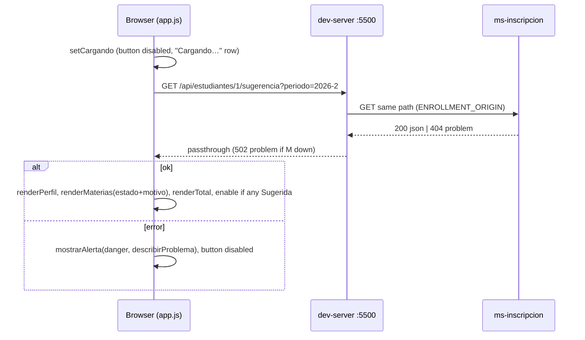
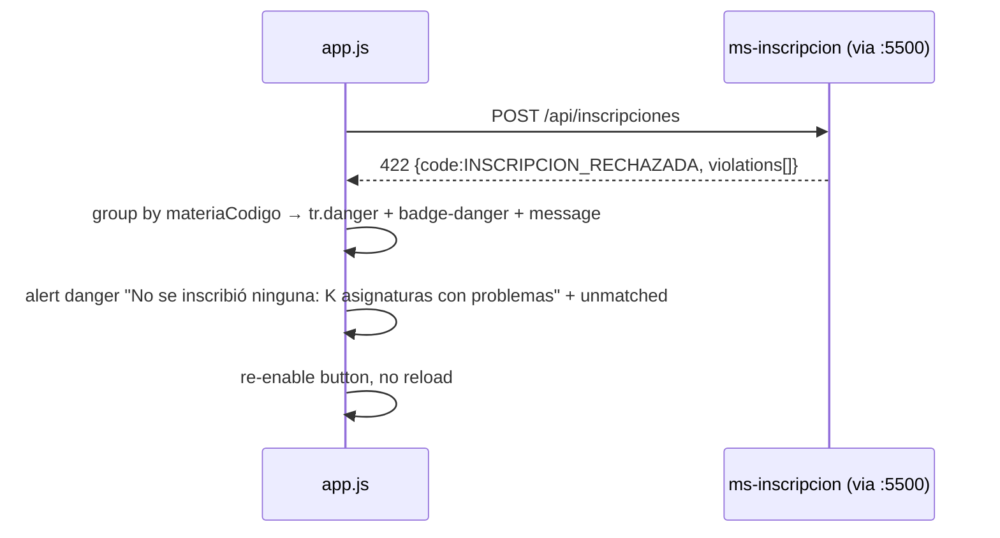

# Design: Conexión front SIPA ↔ ms-inscripcion

## Technical Approach

Same-origin dev proxy (`dev-server.py`, :5500) routes `/api/*` by prefix to identity or ms-inscripcion. `app.js` keeps its three layers (MatriculaApi / UIManager / App): the network layer stops throwing on HTTP errors and returns `{ok, status, body}`; the UI consumes the `sugerencia` payload as-is (it is a superset of the mock); `App` orchestrates load, confirm, 422 per-row violations and ProblemDetails alerts. Backend contract: `regla-n3-sugerencia` (implemented; verified against :8081 on 2026-10-01).

Verified real payloads: GET Laura (`estudianteId=1`) → 12 rows, ids 27–38, `totalCreditos: 23`, `periodo`, `motivo` (`null` or code), `notificaciones: []`. 404/400/422 are `application/problem+json` with `code`, `detail`, `traceId`; 400 adds `errors{}`; 422 adds `violations[{code, materiaId, materiaCodigo, message, details}]`.

## Architecture Decisions

| # | Decision | Alternatives | Rationale |
|---|---|---|---|
| ADR-1 | Proxy prefix routing: `/api/auth`, `/api/users`, `/api/roles`, `/api/demo` → `AUTH_ORIGIN` (default `http://localhost:5132`); any other `/api/*` → `ENROLLMENT_ORIGIN` (default `http://localhost:8080`). Match on path segment (`p`, `p/…`, `p?…`). Origins from env vars, trailing `/` stripped, routing table printed at startup | CORS in ms (P2); whitelist of enrollment prefixes | Identity has exactly those 4 controllers (verified). Default-to-enrollment means new ms endpoints need no proxy change. Same origin ⇒ no CORS, no preflight. Locally: `ENROLLMENT_ORIGIN=http://localhost:8081` |
| ADR-2 | One `_proxy_api()` for GET/POST/PUT/DELETE/OPTIONS (`/api/*` only; non-API POST/PUT/DELETE keep 405) | Only add DELETE | `SimpleHTTPRequestHandler` answers 501 for missing verbs; P2 cancel needs DELETE |
| ADR-3 | Forward `Accept` (default `application/json`), `Content-Type` only when a body exists, `Authorization` only when present | Keep sending all three always | Today an empty `Authorization:` and a bogus `Content-Type` on GET are sent |
| ADR-4 | Upstream status, `Content-Type` and body pass through untouched (already true in the `HTTPError` branch — keep it) | Normalize errors in proxy | Front must see real ProblemDetails |
| ADR-5 | `URLError`/`TimeoutError`/`ConnectionError` → **502 `application/problem+json`** `{type, title:"Servicio no disponible", status:502, detail:"No se pudo conectar con <origin>", code:"PROXY_SIN_CONEXION"}` | `send_error(502)` (HTML) | One parser path in the front; detail names the real origin |
| ADR-6 | **No mapper**: UI reads the API shape directly; `id`/`motivo`/`periodo` are additive and optional for the UI | Adapter translating to mock shape | Shapes already match by construction (spec of `regla-n3-sugerencia`); a mapper would be dead code |
| ADR-7 | Network layer `_request(method, path, body?) → {ok, status, body}`; never throws for HTTP; fetch rejection → `{ok:false, status:0, body:null}`; body = `JSON.parse` of text when content-type contains `json`, else `null` | Throw `Error` with `status/body` (login.js style) | Branching on status is the normal flow (201/422), not an exception |
| ADR-8 | Confirm sends `{estudianteId, periodo, materiaIds}` with `id` of `Sugerida` rows | `codigosMaterias` (backend supports it) | Proposal decision; `id` comes in the same payload. `codigosMaterias` stays as fallback if `id` is ever missing |
| ADR-9 | 422 → violations painted on rows (match `materiaCodigo` → `tr[data-codigo]`, else `materiaId` → `tr[data-id]`), unmatched ones go into the global alert; NO reload. 201 → success + reload | Reload on 422 | Atomic POST: user must see what failed |
| ADR-10 | Fix Bootstrap 3 mismatches: alerts `fade show` → `fade in`; add `.badge-success/.badge-warning/.badge-danger` to `app.css` | Switch to `label label-*` | Verified: BS 3.3.7 has `.fade{opacity:0}` and no `.fade.show` nor `.badge-*` ⇒ today alerts are INVISIBLE and badges grey |

## Data Flow / Sequences



```mermaid
sequenceDiagram
  participant B as app.js
  participant P as :5500
  participant M as ms-inscripcion
  B->>B: ids = Sugerida.map(id); limpiarViolaciones; button "Confirmando…"
  B->>P: POST /api/inscripciones {estudianteId, periodo, materiaIds}
  P->>M: POST (Content-Type, Authorization)
  M-->>B: 201 InscripcionDto[]
  B->>B: alert success "N asignaturas inscritas (2026-2)"
  B->>P: GET sugerencia (reload, keep alert)
  Note over B: inscribed rows vanish (Activa hidden)
```



## Interfaces / Contracts (app.js)

```js
const API_CONFIG = {
  baseURL: '', estudianteId: 1, periodo: '2026-2',
  endpoints: {
    sugerencia: (id, periodo) => `/api/estudiantes/${id}/sugerencia?periodo=${encodeURIComponent(periodo)}`,
    confirmar: '/api/inscripciones'
  },
  useMock: false, mockDelayMs: 400
};
const MOTIVO_LABELS = {          // declared AFTER MOCK_SUGERENCIA
  PREREQUISITO_NO_CUMPLIDO: 'Prerrequisito no aprobado',
  LIMITE_SIGUIENTE_SEMESTRE_EXCEDIDO: 'Cupo de 3 asignaturas extra alcanzado',
  CUPO_AGOTADO: 'Sin cupos disponibles', CRUCE_HORARIO: 'Cruce de horario',
  SEMESTRE_EXCEDIDO: 'Fuera de la ventana de semestres',
  MATERIA_YA_INSCRITA: 'Ya inscrita en el periodo', MATERIA_YA_APROBADA: 'Ya aprobada',
  CARRERA_NO_CORRESPONDE: 'No pertenece a su programa'
};                                // unknown code → show the code
```

- `MatriculaApi`: `_headers`, `_request`, `obtenerSugerencia()`, `confirmarMatricula({estudianteId, periodo, materiaIds})`. Mock: sugerencia → `{ok:true,status:200,body:deepClone}`; confirm → `{ok:true,status:201,body: materiaIds.map(id => ({materiaId:id}))}`.
- `describirProblema(result)` (pure): `0` → "Sin conexión con el servidor local (dev-server.py)"; JSON body → `detail` (+ `errors` values joined with " · " on 400; + `traceId` on 500); non-JSON → `Error HTTP {status}`.
- `UIManager` additions: `setCargando()`, `_celdaEstado(materia)` (badge + `<small>` motivo label, `title` = label), rows get `data-id` when `id != null`, `limpiarViolaciones()`, `renderViolaciones(violations) → unmatched[]`. All via `textContent`.
- `App`: `cargarSugerencia()` (reused by init and after 201), `confirmarMatricula()` with `enviando` guard; button disabled when there are 0 `Sugerida`; missing `id` in real mode → danger alert, no POST. Mock mode skips the post-201 reload.

## MOCK_SUGERENCIA / validar-mocks.mjs group 5

Group 5 takes the FIRST `indexOf('const MOCK_SUGERENCIA')`, brace-matches from the next `{` (not string-aware), evals it with `Function` and compares `JSON.stringify` with `sugerencia_mock.json` (key order matters). Rules: do not edit the literal block (lines 48–73); never write the text `const MOCK_SUGERENCIA` earlier in the file; keep it a pure literal; new code (incl. `MOTIVO_LABELS`) goes outside the block. Currently 36/36 OK.

## File Changes

| File | Action | Description |
|---|---|---|
| `dev-server.py` | Modify | ADR-1..5; env vars; verbs; startup log |
| `assets/js/app.js` | Modify | config, `_request`, `describirProblema`, motivo/violations render, loading, confirm flow, BS3 `fade in`, header comment |
| `assets/css/app.css` | Modify | 3 `.badge-*` colors + `.motivo`/`.violacion` small text |
| `sugerencia-matricula.html` | None/minimal | Structure suffices (5 columns, `#alert-container`, `#btn-confirmar`) |
| `scripts/smoke-proxy.sh` (SIPA root) | Create (optional) | curl via :5500: page 200; `/api/auth/login` admin 200; sugerencia 200; id 999 → 404 problem; POST `codigosMaterias ["603601","603702"]` → 422 (no side effect) |

## Testing Strategy (manual, no TDD)

1. `node src/pruebas/validar-mocks.mjs` → 36/36.
2. `ENROLLMENT_ORIGIN=http://localhost:8081 python dev-server.py`; login as admin works.
3. Table: 12 rows, 8 Sugerida green, 4 Prerrequisito yellow with "Prerrequisito no aprobado", total 23.
4. 422: load the page FIRST, then `curl` enroll 603601 (a reload would hide it, Activa rows are not listed), then confirm in UI → `MATERIA_YA_INSCRITA` on that row, alert visible, no reload.
5. 201 on clean DB → success alert, reload leaves only blocked rows, button disabled.
6. `estudianteId: 999` → 404 detail alert. Stop ms → 502 alert naming the origin.
7. `useMock: true` → offline demo intact.

## Risks

| Risk | Mitigation |
|---|---|
| `ENROLLMENT_ORIGIN` default 8080 vs local 8081 → 502 | Startup log prints the table; 502 detail names the origin |
| Editing near the mock breaks group 5 | Rules above; run validator after apply |
| Materia ids are seed-dependent (27–38) | UI never hardcodes ids; smoke uses `codigosMaterias` |
| `periodo`/`estudianteId` hardcoded (IDOR) | Accepted for demo; single place in `API_CONFIG` |
| `useMock:false` default breaks offline demos | Clear 502/status-0 alert; flip flag |
| CSS fixes change look of existing badges/alerts | Intended (they were broken); scoped to `.badge-*` and alert class |

## Migration / Rollout

No migration. Rollback: `useMock: true`, or `git revert` (front-only).

## Open Questions

- [ ] Smoke 201 path mutates DB (Laura) — keep it out of the script; reset via `docker compose down -v`.
