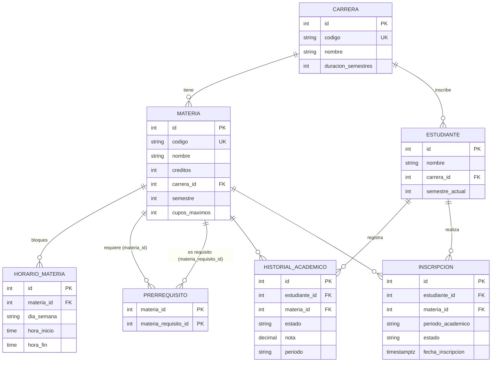

# Design: Inscripcion Microservice (greenfield)

## Technical Approach
A Clean Architecture .NET 8 solution with Controllers, MediatR 12 handlers, and a pure Domain rules engine (Strategy). The engine runs all 6 rules for every candidate materia and returns ALL violations. POST opens one transaction, takes a `SELECT … FOR UPDATE` lock on the student row, then on the materia rows ordered by id. After the lock it counts seats, evaluates the rules, and inserts all enrollments or none. PostgreSQL uses a snake_case schema, and the seed is applied through `HasData` in `InitialCreate`. The API migrates the database on startup.

## Architecture Decisions (ADRs)
| # | Decision | Alternatives | Rationale |
|---|---|---|---|
| 1 | **Controllers** (`[ApiController]`, only `mediator.Send`) | Minimal APIs | About 20 endpoints across 5 resources. `[ApiController]` gives model-binding ProblemDetails, and `ProducesResponseType` improves Swagger. "No logic in controllers" is easy to check. |
| 2 | **Rules engine in Domain** (no packages) | In Application | The rules are pure functions over `EnrollmentContext`. Tests need no mocks or DB. Config values come in through the context, so Domain never reads `IOptions`. |
| 3 | **Repositories + `IUnitOfWork`** in `Application/Abstractions/Persistence` | `IApplicationDbContext` exposing `DbSet<>` | Application stays free of EF. The `FOR UPDATE` SQL and the 23505/23503/40P01 mapping stay in Infrastructure. Handlers can be mocked with Moq. Cost: more interfaces. |
| 4 | **Pessimistic lock** (`FOR UPDATE` on the `estudiantes` row, then on `materias` ordered by id, READ COMMITTED) plus a partial unique index | `xmin` on Materia; counter table | Enrolling never updates Materia, so an `xmin` token on it never changes. Seats are counted per (materia, periodo). A counter table can drift. The student lock serializes concurrent requests of the same student (different overlapping materias would otherwise both pass R3). Lock order is always student then materias (by id), which prevents deadlocks. |
| 5 | **int identity keys** | Guid | `HasData` needs fixed, readable ids for the README requests. |
| 6 | **`HasData` seed** inside the migration | Runtime seeder | Deterministic, versioned, idempotent. Cost: changing the seed needs a new migration. |
| 7 | **Central Package Management** (`Directory.Packages.props`) | Versions in each csproj | Every pin, including the licence-sensitive ones, lives in ONE file. |
| 8 | **`RollForward=Major` for ALL projects** in `Directory.Build.props` | Test projects only | `dotnet-ef` runs the Api startup assembly and needs roll-forward too. It is harmless on the 8.0 Docker images. |
| 9 | **`EFCore.NamingConventions`** (snake_case) | Manual `ToTable`/`HasColumnName` | Readable raw SQL for the lock, with no per-property configuration. |
| 10 | **Custom `TimeOnlyHHmmConverter`** (JSON `"HH:mm"`) plus Swagger `MapType<TimeOnly>` | Default STJ format (`HH:mm:ss`) | Clear contract. Swashbuckle 6 renders `TimeOnly` badly without the mapping. |
| 11 | **Custom `ExceptionHandlingMiddleware`** | `IExceptionHandler` | The requirement asks for global middleware explicitly. One place builds every ProblemDetails. |
| 12 | A concurrent duplicate is normally detected under the lock and returned as **422 INSCRIPCION_RECHAZADA** with violation `MATERIA_YA_INSCRITA`; the 23505 on `ux_inscripciones_activa` maps to **409 MATERIA_YA_INSCRITA** as a defensive backstop | Always 409 | The lock serializes the requests, so the loser re-reads and sees the winner's row; the rules engine reports it as a normal violation. The 409 path is practically unreachable and only guards against bugs or lock bypass. |

## Solution Structure
```
Inscripcion.sln
Directory.Build.props      net8.0, Nullable, ImplicitUsings, RollForward=Major
Directory.Packages.props   ManagePackageVersionsCentrally=true
.config/dotnet-tools.json  dotnet-ef 8.0.11
Dockerfile, docker-compose.yml, .dockerignore, README.md
src/MsInscripcion.Domain/        Entities/, Enums/, Rules/ (IEnrollmentRule, 6 rules, Engine, Context, RuleViolation, ErrorCodes), Services/PrerequisiteGraph.cs, Exceptions/DomainException.cs
src/MsInscripcion.Application/   Abstractions/Persistence/, Common/{Behaviors/ValidationBehavior, Exceptions/, Options/EnrollmentOptions}, Features/{Inscripciones,Carreras,Materias,Horarios,Prerrequisitos}/{Commands,Queries,Dtos}, DependencyInjection.cs
src/MsInscripcion.Infrastructure/ Persistence/{InscripcionDbContext, Configurations/, Repositories/, UnitOfWork, Migrations/, Seed/SeedData.cs}, DependencyInjection.cs
src/MsInscripcion.Api/           Controllers/, Middleware/ExceptionHandlingMiddleware.cs, Json/TimeOnlyHHmmConverter.cs, Program.cs, appsettings*.json
tests/MsInscripcion.UnitTests/   Rules/ (one class per rule), Engine/, Services/PrerequisiteGraphTests.cs, Fixtures/
```
References: Api → Application + Infrastructure. Infrastructure → Application. Application → Domain. UnitTests → Domain + Application.

## ER Diagram

Constraints:
- Enums are stored as strings.
- Check constraints: `hora_inicio < hora_fin`, `materia_id <> materia_requisito_id`.
- Unique index on `historial (estudiante_id, materia_id, periodo)`.
- **Partial unique index** `ux_inscripciones_activa` on `(estudiante_id, materia_id, periodo_academico) WHERE estado = 'Activa'`.
- FKs use `Restrict`, except horarios and prerrequisitos, which `Cascade` from materia.

## Key Contracts
```csharp
public interface IEnrollmentRule { IEnumerable<RuleViolation> Evaluate(EnrollmentContext ctx, Materia candidate); }
public sealed record RuleViolation(string Code, int MateriaId, string MateriaCodigo, string Message,
    IReadOnlyDictionary<string, object>? Details = null);
public sealed record EnrollmentContext(Estudiante Student, string Period, int MaxSemesterAhead, // populated from EnrollmentOptions.MaxSemestersAhead;
    IReadOnlySet<int> ApprovedMateriaIds,
    IReadOnlyList<Materia> ActiveEnrolledMaterias,      // same period, with Horarios
    IReadOnlyDictionary<int, int> ActiveSeatCounts,      // materiaId -> active count for the period
    IReadOnlyList<Materia> Candidates)                   // request order, with Horarios + Prerrequisitos
{ public IEnumerable<Materia> CandidatesBefore(Materia m) => Candidates.TakeWhile(c => c.Id != m.Id); }
public sealed class EnrollmentRulesEngine(IEnumerable<IEnrollmentRule> rules)
{ public IReadOnlyList<RuleViolation> Evaluate(EnrollmentContext ctx) =>
      ctx.Candidates.SelectMany(c => rules.SelectMany(r => r.Evaluate(ctx, c))).ToList(); } // no short-circuit
```
- Rules: `CareerMatchRule`, `PrerequisitesRule`, `ScheduleOverlapRule` (checks active enrollments plus `CandidatesBefore`, puts `conflictsWith` in `Details`; skips an enrolled materia whose id equals the candidate, so that case is only NoDuplicate), `SemesterLimitRule`, `NoDuplicateRule` (MATERIA_YA_APROBADA / MATERIA_YA_INSCRITA), `SeatAvailabilityRule`.
- Overlap test on the same day: `a.Start < b.End && b.Start < a.End`.
- Persistence interfaces:
  - `IMateriaRepository.LockByIdsAsync(ids)`: two steps. First a scalar `SqlQuery<int>($"SELECT id AS \"Value\" FROM materias WHERE id = ANY({ids}) ORDER BY id FOR UPDATE")`, then a regular EF load with Horarios and Prerrequisitos (no composition over `FOR UPDATE`). A lock-time PostgresException is translated by `UnitOfWork.Translate`.
  - `IStudentRepository.LockByIdAsync(id)`: same two-step pattern on `estudiantes` (`FOR UPDATE`), returns the entity or null.
  - `IInscripcionRepository.CountActiveAsync(ids, period)`.
  - `IInscripcionRepository.GetActiveWithScheduleAsync(studentId, period)`.
  - `IStudentRepository.GetApprovedMateriaIdsAsync`.
  - `IUnitOfWork.BeginTransactionAsync()` returns `ITransaction { CommitAsync; RollbackAsync }`, plus `SaveChangesAsync`, which translates Postgres errors into Application exceptions.
- `materias-disponibles` evaluates each candidate on its own, as `ctx with { Candidates = [m] }`, with no lock (advisory).

## POST /api/inscripciones
```mermaid
sequenceDiagram
  participant C as Client
  participant API as InscripcionesController
  participant M as MediatR (ValidationBehavior)
  participant H as EnrollHandler
  participant UoW as IUnitOfWork
  participant DB as PostgreSQL
  C->>API: {estudianteId, periodo, materiaIds[]}
  API->>M: Send(EnrollCommand)
  M-->>C: 400 VALIDACION_FALLIDA / MATERIA_DUPLICADA_EN_SOLICITUD
  M->>H: Handle
  H->>UoW: BeginTransaction (READ COMMITTED)
  H->>DB: SELECT estudiantes WHERE id FOR UPDATE (null → Rollback → 404 ESTUDIANTE_NO_ENCONTRADO)
  H->>DB: SELECT materias WHERE id=ANY ORDER BY id FOR UPDATE
  alt missing ids
    H->>UoW: Rollback → 404 MATERIA_NO_ENCONTRADA
  end
  H->>DB: approved ids, active enrollments+horarios, active seat counts
  H->>H: engine.Evaluate(ctx) — ALL rules, ALL candidates
  alt violations > 0
    H->>UoW: Rollback → 422 INSCRIPCION_RECHAZADA + violations[]
  else ok
    H->>DB: INSERT N inscripciones (Activa, UTC now); SaveChanges
    H->>UoW: Commit (releases locks)
    H-->>C: 201 [InscripcionDto]
  end
  Note over DB,H: lock order student → materias(id asc). Concurrent duplicate → 422 MATERIA_YA_INSCRITA (under lock); 23505 → 409 MATERIA_YA_INSCRITA (backstop); 40P01/40001 → 409 CONFLICTO_CONCURRENCIA
```

## Error Mapping (middleware)
| Source | HTTP | `code` | Extra fields |
|---|---|---|---|
| FluentValidation `ValidationException` / invalid model state | 400 | VALIDACION_FALLIDA (MATERIA_DUPLICADA_EN_SOLICITUD when ids repeat) | `errors{}` |
| `NotFoundException(code)` | 404 | ESTUDIANTE_/MATERIA_/INSCRIPCION_/CARRERA_/HORARIO_NO_ENCONTRADO(A) | — |
| `BusinessRuleViolationException(violations)` | 422 | INSCRIPCION_RECHAZADA | `violations[]{code, materiaId, materiaCodigo, message, details}` |
| `DomainException(code)` | 422 | PRERREQUISITO_CICLICO, HORARIO_INVALIDO | — |
| `ConflictException(code)` | 409 | INSCRIPCION_YA_CANCELADA, CODIGO_DUPLICADO, ENTIDAD_EN_USO (23503), MATERIA_YA_INSCRITA (23505, backstop), CONFLICTO_CONCURRENCIA | — |
| Unhandled | 500 | ERROR_INTERNO | logged by Serilog, no internals leaked |

Every response has the RFC 7807 fields `type, title, status, detail, instance` plus the extensions `code, traceId`. Messages are in Spanish.

## Configuration
`appsettings.json`: `Enrollment: { MaxSemestersAhead: 3, CurrentPeriod: "2026-2" }`. It binds to `EnrollmentOptions`, which is validated on start (`MaxSemestersAhead >= 0`, `CurrentPeriod` matches `^\d{4}-[12]$`). Other settings:
- `ConnectionStrings:Default`
- `Database:ApplyMigrationsOnStartup` (true)
- the `Serilog` section (Console sink)

## Seed Data (period 2026-2)
Carreras:
- 1 ING-SIS (10 semesters)
- 2 ADM (8 semesters, used for rule 1)

Students:
- **1 Ana**: ING-SIS, semester 2. History: MAT101 Aprobada, PRG101 Aprobada, FIS101 Reprobada (2026-1). Active enrollment in ETI101.
- **2 Carlos**: ING-SIS, semester 1. Active enrollment in ALG201.

| Id | Código | Sem | Cupos | Horario | Prerrequisito | Exercises (for Ana) |
|---|---|---|---|---|---|---|
| 1 | MAT101 Cálculo I | 1 | 30 | Lun/Mié 06-08 | — | MATERIA_YA_APROBADA |
| 2 | FIS101 Física I | 1 | 30 | Lun 09-11 | — | retake OK; CRUCE_HORARIO with MAT201 in the same request |
| 3 | PRG101 Programación I | 1 | 30 | Mar 08-10 | — | prerequisite source |
| 4 | ETI101 Ética | 1 | 30 | Vie 08-10 | — | MATERIA_YA_INSCRITA |
| 5 | HUM101 Humanidades | 1 | 30 | Vie 09-11 | — | CRUCE_HORARIO with the existing ETI101 |
| 6 | MAT201 Cálculo II | 2 | 30 | Lun 08-10, Mié 10-12 | MAT101 | happy path |
| 7 | PRG201 Programación II | 2 | 30 | Mar 10-12, Jue 10-12 | PRG101 | happy path |
| 8 | EST201 Estadística | 2 | 30 | Mar 12-14 | — | back-to-back with PRG201: NO clash (half-open) |
| 9 | ALG201 Álgebra Lineal | 2 | **1** | Jue 14-16 | — | CUPO_AGOTADO (Carlos holds the seat) |
| 10 | EDD301 Estructuras de Datos | 3 | 30 | Mié 14-16 | PRG201 | PREREQUISITO_NO_CUMPLIDO |
| 11 | ING601 Ingeniería de Software | 6 | 30 | Jue 16-18 | — | SEMESTRE_EXCEDIDO (2+3=5) |
| 12 | ADM101 Contabilidad (carrera 2) | 1 | 30 | Sáb 08-10 | — | CARRERA_NO_CORRESPONDE |

- Happy path: `[6,7,8]`.
- ALL-violations demo: `[1,2,6,4,9,10,11,12]`. It returns 7 violations (one each on MAT101, MAT201, ETI101, ALG201, EDD301, ING601, ADM101; FIS101 and MAT201 are back-to-back with MAT101, so no clash), and FIS101 is listed before MAT201, so the clash is reported on MAT201. The demo leaves out HUM101 (5) to keep the output readable. HUM101 alone still demos the clash with the existing enrollment.

## Docker
- `Dockerfile`: stage `mcr.microsoft.com/dotnet/sdk:8.0` copies the `*.props` and `*.csproj` files, runs restore, then runs `publish -c Release`. The final stage `aspnet:8.0` runs with `ASPNETCORE_URLS=http://+:8080` as a non-root `app` user.
- `docker-compose.yml`:
  - `db`: `postgres:16-alpine`, a named volume, and a healthcheck `pg_isready -U postgres -d inscripcion` (interval 5s, 10 retries).
  - `api`: `depends_on: db: condition: service_healthy`, with `ConnectionStrings__Default` set through env, port `8080:8080`, and `ASPNETCORE_ENVIRONMENT=Development` so Swagger is on.
- `Program.cs` runs `MigrateAsync()` (which also applies the `HasData` seed) when `Database:ApplyMigrationsOnStartup` is set.

## Package Pins (Directory.Packages.props)
| Package | Version |
|---|---|
| MediatR | 12.5.0 |
| FluentValidation, FluentValidation.DependencyInjectionExtensions | 11.11.0 |
| Microsoft.EntityFrameworkCore, .Relational, .Design (PrivateAssets=all) | 8.0.11 |
| Npgsql.EntityFrameworkCore.PostgreSQL | 8.0.11 |
| EFCore.NamingConventions | 8.0.3 |
| Microsoft.Extensions.Options.ConfigurationExtensions | 8.0.0 |
| Serilog.AspNetCore | 8.0.3 |
| Swashbuckle.AspNetCore | 6.9.0 |
| xunit / xunit.runner.visualstudio | 2.9.2 / 2.8.2 |
| Microsoft.NET.Test.Sdk | 17.11.1 |
| FluentAssertions | 6.12.2 |
| Moq | 4.20.72 |
| coverlet.collector | 6.0.2 |
| dotnet-ef (tool) | 8.0.11 |

## Testing Strategy
| Layer | What | Approach |
|---|---|---|
| Unit | Each rule: success and failure (overlap also covers back-to-back and in-request cases); the engine collects all violations; `PrerequisiteGraph` cycle check | xUnit + FluentAssertions with in-memory builders, no DB |
| Unit (optional) | `EnrollHandler` rollback on violations | Moq on the repositories and `IUnitOfWork` |
| Integration | Lock and concurrency | Deferred; manual check with compose |

## Migration / Rollout
Apply runs `dotnet ef migrations add InitialCreate -p src/MsInscripcion.Infrastructure -s src/MsInscripcion.Api` exactly once, with `DOTNET_ROLL_FORWARD=Major`. If it fails, report the errors and stop. The migration must NOT create an `xmin` column (none is mapped). Rollback: delete the generated files and run `docker compose down -v`.

## Open Questions
None blocking. Assumptions go in the README: `Cursando` does not count as approved, `Cancelada` enrollments are ignored everywhere, and there is no period entity.
