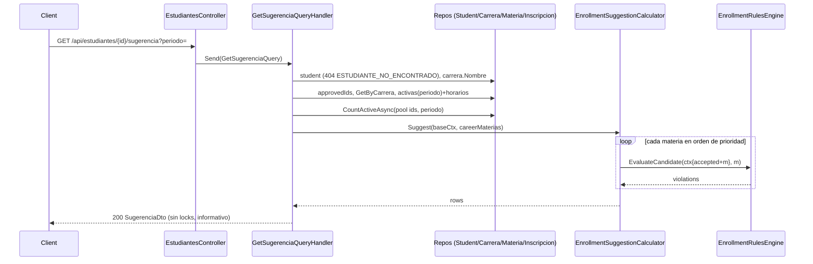

# Design: Regla N+3 (N completo + tope 3 compartido) y endpoint de sugerencia

Change: `regla-n3-sugerencia` · Inputs: `proposal.md` (A1–A5 son decisiones del usuario), `inscripcion-microservice/design.md`, código actual de `feature/ms-inscripcion`.

## Technical Approach

La regla queda **dentro del motor de reglas existente** (Strategy por regla, `EnrollmentRulesEngine`). Se reemplaza `SemesterLimitRule` por `SemesterWindowRule` (ventana `≤ N+1`) y se agrega `ExtraSubjectsCapRule` (tope compartido adeudadas + N+1). La sugerencia es un **servicio de dominio puro** (`EnrollmentSuggestionCalculator`) que recorre las materias en orden de prioridad y llama al motor **una materia a la vez** con un contexto cuyo `Candidates` son las filas ya aceptadas + la evaluada. Así el POST y la sugerencia ejecutan **exactamente las mismas reglas**: el tope, el cruce y el cupo "secuenciales" salen gratis de `CandidatesBefore`, sin lógica duplicada.

Término: **extra** = materia de la carrera del estudiante, no aprobada, con `Semestre < N` (adeudada, incluye `Reprobada`/`Cursando`) o `Semestre == N+1`. El tope cuenta extras **activas del período + candidatas previas + la evaluada**.

## Architecture Decisions (ADRs)

| # | Decisión | Alternativas | Elegido y por qué |
|---|---|---|---|
| D1 | Descomposición de reglas | (a) una regla "N+3" que haga ventana+tope; (b) dos Strategies | **(b)** `SemesterWindowRule` (reemplaza `SemesterLimitRule`, código `SEMESTRE_EXCEDIDO`, mismos `details` `materiaSemestre`/`maxAllowedSemestre`) + `ExtraSubjectsCapRule`. Una regla = un validador (convención del proyecto); se testean por separado. |
| D2 | Nombre de la regla del tope | `NextSemesterCapRule` | **`ExtraSubjectsCapRule`**: cuenta adeudadas + N+1 (A2), el nombre anterior mentiría. Los **contratos externos NO se renombran**: código `LIMITE_SIGUIENTE_SEMESTRE_EXCEDIDO` y clave `Enrollment:MaxNextSemesterSubjects` se mantienen como en el proposal (specs y front ya los usan); XML doc aclara la semántica compartida. |
| D3 | Dónde vive la asignación secuencial | (a) en el engine (modo "sugerencia"); (b) en la query de Application; (c) servicio de dominio puro | **(c)** `Domain/Services/EnrollmentSuggestionCalculator` (junto a `PrerequisiteGraph`), singleton, recibe `EnrollmentRulesEngine`. El engine sigue siendo "evaluar reglas"; el orden/prioridad es política de negocio pura y testeable sin mocks. (b) acoplaría reglas a I/O. |
| D4 | Evitar duplicar lógica | reimplementar tope/cruce en el calculador | El calculador **no conoce reglas**: llama `engine.EvaluateCandidate(ctx with { Candidates = [..accepted, m] }, m)`. Nuevo método en el engine; `Evaluate` pasa a componerse de él. |
| D5 | Cambios en `EnrollmentContext` | agregar set de adeudadas, mapa semestre, contador N+1 | **Mínimo**: `int MaxSemesterAhead` → `int MaxExtraSubjects`; helper `bool IsExtra(Materia m)`. Adeudada se **deriva** de `Student.SemestreActual`, `ApprovedMateriaIds` y `Materia.Semestre` (ya cargado en `ActiveEnrolledMaterias` vía `GetActiveWithScheduleAsync`). No hace falta leer historial completo: `Reprobada`/`Cursando` = "no aprobada" (A5). |
| D6 | Opciones | mantener `MaxSemestersAhead` deprecada | **Eliminar** `MaxSemestersAhead` (opciones, `Validate()`, `appsettings.json`, `docker-compose.yml`). Nueva `MaxNextSemesterSubjects` (default 3), validación `>= 0` (0 = solo N), fail-fast existente. |
| D7 | `codigosMaterias` | resolver en Domain; resolver dentro del lock | **Application, antes de abrir la transacción** (lectura simple, no altera el orden de locks student → materias). Nuevo `IMateriaRepository.GetIdsByCodigosAsync`. XOR validado en FluentValidation (`VALIDACION_FALLIDA` 400); repetidos → `MATERIA_DUPLICADA_EN_SOLICITUD`; desconocidos → 404 `MATERIA_NO_ENCONTRADA` listando códigos. Tras el lock, el flujo es idéntico al de `materiaIds`. |
| D8 | Forma de la respuesta | DTO nuevo vs reutilizar `MateriaDto` | **DTO nuevo** espejo del fixture + aditivos `id`, `periodo`, `motivo`. `estado` es enum `EstadoSugerencia {Sugerida, Prerrequisito}` serializado como string (`JsonStringEnumConverter` ya registrado). Solo dos estados (contrato del front); `motivo` distingue causa. |
| D9 | `materias-disponibles` | eliminar; lógica propia | **Delegar al calculador** y devolver solo `Sugerida` como `MateriaDto`; `[Obsolete]` en la acción (Swashbuckle 6.9 la marca `deprecated`) + nota en README. |
| D10 | Filas excluidas de la sugerencia | mostrar aprobadas/inscritas | Se **omiten** aprobadas, ya inscritas `Activa` en el período, otra carrera y `> N+1`. Las inscritas activas sí ocupan horario y cupo del tope (vienen en `ActiveEnrolledMaterias`). |
| D11 | Carga de las 53 materias | (a) C# literal generado; (b) JSON embebido parseado en `SeedData` → `HasData`; (c) seeder en runtime | **(a)**: sigue el patrón actual (`HasData` explícito, ids deterministas, diff de migración legible, sin IO en design-time). (b) es una sola fuente pero mete parsing/derivación de ids en el model building; (c) saca la semilla de las migraciones y exige idempotencia. El script generador es descartable (scratchpad), no se commitea; un test de consistencia protege el resultado. |
| D12 | Migración | regenerar `InitialCreate` | **Nueva migración `UnillanosSeed`** (diff de `HasData`). No reescribe historia ya pusheada, BDs existentes se actualizan, rollback = `Down`/borrar la migración (coincide con el proposal). Para estado limpio de demo, README indica `docker compose down -v`. Identity `startValue 1000` intacto (el seed máximo es < 200). **La genera el usuario** con `dotnet ef migrations add` (compila; los agentes no buildean). |

## Calculator Algorithm

```
Suggest(baseCtx /* Candidates = [] */, careerMaterias):
  N = baseCtx.Student.SemestreActual
  pool = careerMaterias.Where(m => m.Semestre <= N + 1
                               && !Approved(m) && !ActiveEnrolled(m))
  // prioridad de evaluación: N (no consume tope) → adeudadas → N+1; dentro: Codigo ordinal asc (A1)
  evalOrder = pool.OrderBy(m => m.Semestre == N ? 0 : m.Semestre < N ? 1 : 2).ThenBy(m => m.Codigo, Ordinal)
  accepted = []; rows = []
  foreach m in evalOrder:
    v = engine.EvaluateCandidate(baseCtx with { Candidates = [..accepted, m] }, m)
    if v.Count == 0: accepted.Add(m); rows.Add(Sugerida(m, prereqOk: true))
    else: rows.Add(Prerrequisito(m,
            prereqOk: !v.Any(PREREQUISITO_NO_CUMPLIDO),
            motivo: first of v by priority [PREREQUISITO_NO_CUMPLIDO, CUPO_AGOTADO, CRUCE_HORARIO, LIMITE_SIGUIENTE_SEMESTRE_EXCEDIDO, otros]))
  return rows.OrderBy(Semestre).ThenBy(Codigo, Ordinal)   // = adeudadas, N, N+1 (orden de malla)
```

Consecuencias (A3): una fila bloqueada **no entra a `accepted`**, por lo tanto no consume cupo del tope ni bloquea horario; la siguiente elegible toma el lugar. El cruce se evalúa solo contra activas + `accepted` (prioridad mayor). A4 sale solo: no existen materias `N+1` si N es el último. `totalCreditos = Σ creditos(Sugerida)`.

`ExtraSubjectsCapRule.Evaluate(ctx, c)`:
```
if !ctx.IsExtra(c) yield break      // IsExtra: misma carrera ∧ no aprobada ∧ (Semestre < N ∨ Semestre == N+1)
used = ctx.ActiveEnrolledMaterias.Count(m => ctx.IsExtra(m) && m.Id != c.Id)
     + ctx.CandidatesBefore(c).Count(ctx.IsExtra)
if used + 1 > ctx.MaxExtraSubjects -> LIMITE_SIGUIENTE_SEMESTRE_EXCEDIDO {max, used}
```
En el POST se reportan las extras que excedan en orden del request (4.ª en adelante); la solicitud se rechaza completa.

## Sequence: GET sugerencia



## Sequence: POST con tope bajo locks

```mermaid
sequenceDiagram
  participant C as Client
  participant H as EnrollCommandHandler
  participant DB as PostgreSQL
  participant E as EnrollmentRulesEngine
  C->>H: POST {estudianteId, periodo, materiaIds | codigosMaterias}
  opt codigosMaterias
    H->>DB: SELECT id,codigo WHERE codigo IN (...) (sin lock)
    Note over H: desconocidos → 404 MATERIA_NO_ENCONTRADA
  end
  H->>DB: BEGIN
  H->>DB: estudiante FOR UPDATE (serializa al mismo estudiante)
  H->>DB: materias FOR UPDATE ORDER BY id
  H->>DB: aprobadas, activas(periodo)+horarios, conteo cupos
  H->>E: Evaluate(ctx) (ventana, tope, prerrequisitos, cruce, cupo, ...)
  alt violaciones
    H->>DB: ROLLBACK → 422 INSCRIPCION_RECHAZADA
  else ok
    H->>DB: INSERT inscripciones; COMMIT → 201
  end
```

**Race-free**: el tope depende solo de inscripciones del **mismo estudiante**; toda escritura de inscripciones pasa por `EnrollCommand`, que toma el lock del estudiante antes de leer activas. En READ COMMITTED cada sentencia posterior al lock ve lo confirmado por la transacción previa, así que el conteo nunca está desactualizado. `CancelCommand` solo libera tope (nunca lo excede). Cupos entre estudiantes siguen protegidos por el lock de materias.

## Interfaces / Contracts

```csharp
// Domain
public sealed record EnrollmentContext(Estudiante Student, string Period, int MaxExtraSubjects,
    IReadOnlySet<int> ApprovedMateriaIds, IReadOnlyList<Materia> ActiveEnrolledMaterias,
    IReadOnlyDictionary<int,int> ActiveSeatCounts, IReadOnlyList<Materia> Candidates) { bool IsExtra(Materia m); ... }
public IReadOnlyList<RuleViolation> EvaluateCandidate(EnrollmentContext ctx, Materia candidate); // engine
public enum EstadoSugerencia { Sugerida, Prerrequisito }
public sealed record SuggestionRow(Materia Materia, EstadoSugerencia Estado, bool PrerrequisitoCumplido, string? Motivo);
// Application
public sealed record EnrollCommand(int EstudianteId, string Periodo, IReadOnlyList<int>? MateriaIds, IReadOnlyList<string>? CodigosMaterias = null);
Task<IReadOnlyDictionary<string,int>> GetIdsByCodigosAsync(IReadOnlyCollection<string> codigos, CancellationToken ct); // IMateriaRepository
```

`GET /api/estudiantes/{id}/sugerencia?periodo=AAAA-[12]` → 200 / 400 `VALIDACION_FALLIDA` / 404 `ESTUDIANTE_NO_ENCONTRADO`:

```json
{ "nombreEstudiante": "Laura Gómez Ríos", "programa": "Ingeniería de Sistemas", "semestreActual": 6,
  "periodo": "2026-2", "totalCreditos": 23,
  "materiasSugeridas": [ { "id": 27, "codigo": "603601", "nombre": "Ingeniería de Software II", "creditos": 3,
      "semestre": 6, "estado": "Sugerida", "prerrequisitoCumplido": true, "motivo": null } ],
  "notificaciones": [] }
```
`programa` = `Carrera.Nombre`; `notificaciones` tipado `NotificacionDto(id, titulo, mensaje, fecha, leida)` siempre vacío. `motivo` se serializa `null` en `Sugerida` (no hay `DefaultIgnoreCondition` global; no se cambia).

`POST /api/inscripciones` body: `{estudianteId, periodo, materiaIds?: int[], codigosMaterias?: string[]}` (exactamente uno no vacío). Respuestas sin cambios + nuevo código 422 `LIMITE_SIGUIENTE_SEMESTRE_EXCEDIDO` (`details`: `maxExtraSubjects`, `used`).

## Seed Redesign (período 2026-2)

**Ids**: carrera 1 `ING-SIS` "Ingeniería de Sistemas" (10 sem), carrera 2 `ADM` (8 sem). Materias 1–53 en el orden de `malla_curricular.json` (sem1 1–5, sem2 6–10, sem3 11–15, sem4 16–20, sem5 21–26, sem6 27–32, sem7 33–38, sem8 39–44, sem9 45–49, sem10 50–53); materia 54 `ADM101` (carrera 2, sem 1). 33 prerrequisitos desde la malla. `cuposMaximos = 30` salvo **603903 = 1**.

**Horarios** (k = índice por `Codigo` asc dentro del semestre; semestres impares mañana, pares tarde → N y N+1 nunca chocan):

| k | Impar | Par |
|---|---|---|
| 0 | Lun+Mié 07–09 | Lun+Mié 14–16 |
| 1 | Lun+Mié 09–11 | Lun+Mié 16–18 |
| 2 | Mar+Jue 07–09 | Mar+Jue 14–16 |
| 3 | Mar+Jue 09–11 | Mar+Jue 16–18 |
| 4 | Vie 07–11 | Vie 14–18 |
| 5 | Sáb 07–11 | Sáb 14–18 |

Overrides: **603305** → Sáb 11–13 (adeudada de Camila, sin chocar con sus N/N+1); **603902** → Lun+Mié 14–16 (**cruce deliberado** con 603801); `ADM101` → Sáb 18–20. ≈94 bloques.

**Estudiantes** (historial: notas de Laura del fixture; resto 4.0 / `Reprobada` 2.5; período por semestre retrocediendo desde 2026-1):

| Id | Nombre | Sem | Historial | Sugerencia esperada |
|---|---|---|---|---|
| 1 | Laura Gómez Ríos | 6 | 26 Aprobada (fixture) | Fixture corregido: 6 N + 603701, 603703 → **23** cr.; 702/704/705/706 prereq=false |
| 2 | Mateo (inv.) | 7 | sem 1–6 Aprobada (32) | 801, 802, 803 Sugerida; 804, 806 `LIMITE` (true); 805 prereq (false) |
| 3 | Camila (inv.) | 7 | sem 1–6, **603305 Reprobada** | 603305 Sugerida (adeudada); 801, 802 Sugerida; 803, 804, 806 `LIMITE`; 805 prereq |
| 4 | Sofía (inv.) | 8 | sem 1–7 Aprobada (38) | 801–806 Sugerida; 901 prereq; 902 `CRUCE_HORARIO`; 903 `CUPO_AGOTADO`; 904, 905 Sugerida (A3: el cupo pasa) |
| 5 | Andrés (inv.) | 9 | — | Relleno: inscripción `Activa` 2026-2 en 603903 (agota el cupo) |

Casos POST: Mateo 801–804 → `LIMITE`; Camila 801–803 sin adeudada → 201 (A2 no obligatoria), 305+801–803 → `LIMITE`; Laura 603601+603702 → `PREREQUISITO_NO_CUMPLIDO`; Laura 603801 → `SEMESTRE_EXCEDIDO`; Laura `ADM101` → `CARRERA_NO_CORRESPONDE`; Sofía 801+902 → `CRUCE_HORARIO`; Sofía 903 → `CUPO_AGOTADO`; Laura 603101 → `MATERIA_YA_APROBADA`.

## File Changes

| File | Action | Description |
|---|---|---|
| `src/MsInscripcion.Domain/Rules/SemesterLimitRule.cs` | Delete | Reemplazada |
| `src/MsInscripcion.Domain/Rules/SemesterWindowRule.cs` | Create | `> N+1` → `SEMESTRE_EXCEDIDO` |
| `src/MsInscripcion.Domain/Rules/ExtraSubjectsCapRule.cs` | Create | Tope compartido |
| `src/MsInscripcion.Domain/Rules/EnrollmentContext.cs` | Modify | `MaxExtraSubjects`, `IsExtra` |
| `src/MsInscripcion.Domain/Rules/EnrollmentRulesEngine.cs` | Modify | `EvaluateCandidate` |
| `src/MsInscripcion.Domain/Rules/ErrorCodes.cs` | Modify | `ExtraSubjectsCapExceeded` |
| `src/MsInscripcion.Domain/Enums/EstadoSugerencia.cs` | Create | Enum de estado |
| `src/MsInscripcion.Domain/Services/EnrollmentSuggestionCalculator.cs` (+ `SuggestionRow`) | Create | Algoritmo |
| `src/MsInscripcion.Application/Common/Options/EnrollmentOptions.cs` | Modify | Quitar `MaxSemestersAhead`, agregar `MaxNextSemesterSubjects` |
| `src/MsInscripcion.Application/DependencyInjection.cs` | Modify | Registrar reglas nuevas + calculador |
| `src/MsInscripcion.Application/Features/Sugerencia/{Queries/GetSugerenciaQuery.cs,Dtos/SugerenciaDto.cs}` | Create | Query, validator, handler, DTOs |
| `.../Features/Materias/Queries/MateriasDisponiblesQuery.cs` | Modify | Delegar al calculador |
| `.../Features/Inscripciones/Commands/EnrollCommand.cs` | Modify | XOR, resolución de códigos, opción nueva |
| `.../Abstractions/Persistence/IMateriaRepository.cs`, `Infrastructure/.../MateriaRepository.cs` | Modify | `GetIdsByCodigosAsync` |
| `src/MsInscripcion.Api/Controllers/EstudiantesController.cs` | Modify | `GET sugerencia`; `[Obsolete]` en disponibles |
| `src/MsInscripcion.Api/Controllers/InscripcionesController.cs` | Modify | `EnrollRequest` con `CodigosMaterias` |
| `src/MsInscripcion.Api/appsettings.json`, `docker-compose.yml` | Modify | Clave nueva, quitar vieja |
| `src/MsInscripcion.Infrastructure/Persistence/Seed/SeedData.cs` | Modify | Seed Unillanos (literal generado) |
| `src/MsInscripcion.Infrastructure/Persistence/Migrations/*_UnillanosSeed.cs` + snapshot | Create/Modify | Generado por el usuario |
| `tests/.../Rules/SemesterLimitRuleTests.cs` → `SemesterWindowRuleTests.cs` | Rename/Rewrite | Éxito/falla, N+1 límite |
| `tests/.../Rules/ExtraSubjectsCapRuleTests.cs` | Create | ≤3, 4.º, activas cuentan, adeudada cuenta, N no cuenta, otra carrera no cuenta |
| `tests/.../Services/EnrollmentSuggestionCalculatorTests.cs` | Create | Orden, tope, A2, A3 (cupo/cruce pasan slot), A4, prereq true/false, motivo |
| `tests/.../Seed/SeedDataTests.cs` | Create | 53 materias, códigos únicos, 33 prereqs válidos, **calculador sobre SeedData** = fixture (23 cr.) y casos Mateo/Camila/Sofía |
| `tests/.../Engine/EnrollmentRulesEngineTests.cs`, `Handlers/EnrollCommandHandlerTests.cs`, `Fixtures/TestData.cs` | Modify | Contexto nuevo, `codigosMaterias`, XOR |
| `tests/.../Handlers/GetSugerenciaQueryHandlerTests.cs` | Create | Mapeo, `totalCreditos`, 404 |
| `scripts/e2e.sh` | Rewrite | Misma estructura (`t`, `race`, secciones); ids/códigos nuevos; sección "Sugerencia"; races usan materia cupo 1 creada en CRUD |
| `postman/MsInscripcion.postman_collection.json` | Rewrite | Mismas carpetas + "Sugerencia"; ids nuevos |
| `README.md` | Modify | Reglas/códigos, Configuración, Datos semilla, curl, endpoint nuevo + deprecated, Migraciones (`down -v`), Supuestos A1–A5 |

## Testing Strategy

| Layer | What | Approach |
|---|---|---|
| Unit | Reglas, calculador, seed, handlers | xUnit + FluentAssertions + Moq, sin DB (Standard Mode, después del código) |
| E2E | Contrato HTTP y casos de seed | `scripts/e2e.sh` + Postman contra docker compose (ejecuta el usuario) |

## Migration / Rollout

1. Usuario: `dotnet ef migrations add UnillanosSeed -p src/MsInscripcion.Infrastructure -s src/MsInscripcion.Api`; revisar que solo haya `InsertData/UpdateData/DeleteData`. 2. `docker compose down -v && docker compose up --build` para estado limpio. Rollback: revertir commits + borrar la migración.

## Risks / Open Questions

- [ ] **Migración la debe generar el usuario** (los agentes no compilan); escribirla a mano es propenso a errores con ~300 filas.
- [ ] EF 8 no detecta snapshot desincronizado al migrar; mitigación: revisar el diff y el `SeedDataTests`.
- [ ] Upgrade in-place de BDs con datos de e2e viejos deja inscripciones apuntando a materias renombradas → recomendar `down -v`.
- [ ] Nombre de la clave `MaxNextSemesterSubjects` y del código `LIMITE_SIGUIENTE_SEMESTRE_EXCEDIDO` ya no describen "adeudadas + N+1"; se conservan por contrato. ¿Renombrar en un change futuro?
- [ ] D10: filas ya inscritas `Activa` se omiten (no suman `totalCreditos`); confirmar con el front si deben mostrarse.
- [ ] `estado="Prerrequisito"` también cubre cupo/cruce/tope (contrato de 2 estados); el front debe leer `motivo` para el texto.
- [ ] Entre resolución de `codigosMaterias` y el lock un código podría cambiar (CRUD de materias); impacto despreciable, se acepta.
