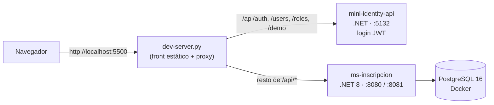
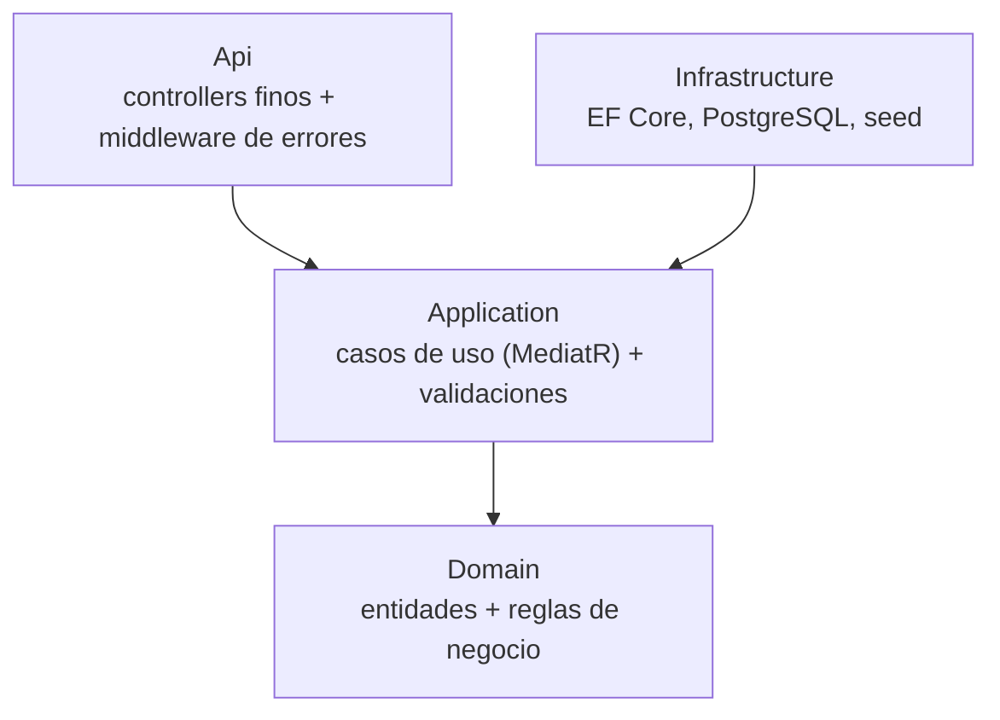
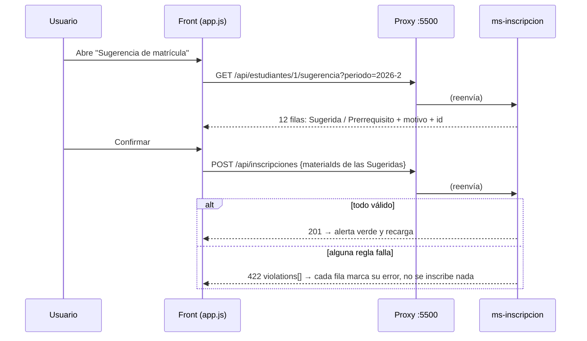

# Arquitectura y ajustes realizados

Documento corto para entender **cómo está armado SIPA** y **qué se cambió** en la rama `feature/ms-inscripcion`. El detalle técnico de cada servicio vive en su propio README (ver [Más información](#más-información)).

---

## 1. Cómo está construido

SIPA tiene tres piezas. El navegador solo habla con **una**: el `dev-server.py`, que sirve el front y hace de *proxy* hacia las dos APIs. Por eso no hace falta CORS.

| Pieza | Tecnología | Para qué sirve |
|---|---|---|
| **Front** (`index.html`, `sugerencia-matricula.html`, `assets/`) | HTML + jQuery + Bootstrap 3 | Login y pantalla de sugerencia de matrícula |
| **Proxy** (`dev-server.py`) | Python (stdlib) | Sirve el front y reenvía cada `/api/*` a la API que corresponde |
| **Identity** (`backend/mini-identity-api-dotnet`) | .NET, en memoria | Login y emisión del token JWT |
| **ms-inscripcion** (`backend/ms-inscripcion`) | .NET 8, EF Core, PostgreSQL | Reglas de inscripción, sugerencia de materias, catálogo |

### ms-inscripcion por dentro (Clean Architecture)

- **Domain** no depende de nada: ahí viven las reglas. Cada regla es una clase separada (patrón *Strategy*) y un **motor** las evalúa todas y devuelve **todas** las violaciones juntas.
- **Application** orquesta: carga datos, llama al motor, inscribe en una **transacción** (todo o nada).
- **Infrastructure** implementa la persistencia y bloquea filas (`FOR UPDATE`) para que dos inscripciones simultáneas no rompan cupos ni horarios.
- **Api** solo traduce HTTP ↔ casos de uso. Los errores salen siempre como **ProblemDetails** (`application/problem+json`) con un `code` explícito.

### Cómo viaja una sugerencia

---

## 2. La regla de inscripción (regla "N+3")

Un estudiante en el semestre **N** puede inscribir:

1. **Todo el semestre N.**
2. **Hasta 3 materias "extra"**, compartidas entre:
   - materias **adeudadas** de semestres anteriores (tienen **prioridad**, pero **no son obligatorias**), y
   - materias del semestre **N+1**.
3. Nada por encima de N+1 (`SEMESTRE_EXCEDIDO`).

Además:

- **Prerrequisitos estrictos:** solo cuenta una materia **aprobada**. No vale "la estoy cursando ahora".
- Siguen aplicando: misma carrera, cruce de horarios, cupos y no repetir materias aprobadas o ya inscritas.
- En la **sugerencia**, una materia que no se puede tomar (sin cupo, cruce) **no gasta** uno de los 3 lugares: se muestra bloqueada con su motivo y el lugar pasa a la siguiente.

**Ejemplo — Laura (semestre 6, todo aprobado hasta el 5):**

| Semestre | Materias | Resultado |
|---|---|---|
| 6 | 603601 … 603606 | las 6 **Sugeridas** (18 créditos) |
| 7 | 603701, 603703 | **Sugeridas** (5 créditos) |
| 7 | 603702, 603704, 603705, 603706 | **Bloqueadas**: su prerrequisito es del semestre 6 y todavía no está aprobado |
| **Total** | | **23 créditos** |

---

## 3. Ajustes realizados en esta rama

### Integración en el repo

- El microservicio se incorporó en `backend/ms-inscripcion` con `git subtree`, **conservando su historial**.
- Se mergeó `feature/datos-mock` (malla real de Unillanos y datos de prueba).

### Backend (ms-inscripcion)

| Ajuste | Antes | Ahora |
|---|---|---|
| Regla de semestres | Hasta el semestre N+3, sin tope | Semestre N + máx. 3 extras (adeudadas + N+1) |
| Configuración | `Enrollment:MaxSemestersAhead` | `Enrollment:MaxNextSemesterSubjects` (= 3) |
| Endpoint nuevo | — | `GET /api/estudiantes/{id}/sugerencia` con la forma que espera el front + `id` y `motivo` por fila |
| Inscribir | solo `materiaIds` | `materiaIds` **o** `codigosMaterias` (ej. `"603601"`) |
| `materias-disponibles` | cálculo propio | usa el mismo cálculo que la sugerencia (marcado obsoleto) |
| Datos semilla | carrera ficticia | malla real de Unillanos (53 materias) + 5 estudiantes de prueba |
| Migración | `InitialCreate` original | `InitialCreate` regenerada (requiere `docker compose down -v`) |
| Puertos Docker | fijos | configurables con `API_PORT` y `DB_PORT` |

### Front

| Ajuste | Detalle |
|---|---|
| Proxy por prefijo | `/api/auth\|users\|roles\|demo` → identity; el resto → ms-inscripcion (`ENROLLMENT_ORIGIN`). Soporta GET/POST/PUT/DELETE/OPTIONS |
| Backend caído | El proxy responde **502** claro: *"No se pudo conectar con el servicio en …"* |
| Datos reales | `useMock: false`: la tabla se llena desde la API. El mock queda como modo *offline* |
| Errores visibles | Un 422 marca **cada fila** con su error; los demás errores muestran el `detail` de la API |
| Mock corregido | `sugerencia_mock.json` pasó de 26 a **23 créditos** (prerrequisitos estrictos) |

### Bugs corregidos

Los dos últimos de la tabla ya venían resueltos en el historial del microservicio; el resto se corrigió durante esta integración.

| Bug | Causa | Arreglo |
|---|---|---|
| Las alertas del front **nunca se veían** | Se usaban clases de Bootstrap 4 (`fade show`, `badge-*`) sobre Bootstrap 3.3.7 | `fade in` + clases de badge en `app.css` |
| La migración fallaba en una BD nueva (`23503`) | EF actualizaba inscripciones antes de insertar las materias nuevas | Una sola `InitialCreate` limpia |
| Dos listas en el POST devolvían el código equivocado | Las reglas de duplicados corrían igual | Solo corren cuando viene exactamente una lista |
| `.sh` con fin de línea de Windows | Faltaba `.gitattributes` en la raíz | `*.sh text eol=lf` |
| Errores de framework (400 de binding, 415) como `application/json` | `[Produces("application/json")]` pisaba el tipo | Se quitó el atributo |
| Mismo estudiante con dos pedidos simultáneos podía cruzar horarios | Solo se bloqueaban las materias | Se bloquea también la fila del estudiante |

---

## 4. Limitaciones conocidas

- El `estudianteId` y el `periodo` están **fijos** en `assets/js/app.js` (`API_CONFIG`). Sirve para la demo, pero cualquiera podría cambiar el id. Lo correcto es validar el JWT en ms-inscripcion y exponer `/api/estudiantes/me`.
- Identity responde **500** (no 401) con credenciales incorrectas.
- No hay control de sesión en el front: el enlace "Cerrar Sesión" apunta al sistema de Unillanos y la página de sugerencia no exige estar logueado.
- Cupos y horarios del seed son **inventados**: la malla de Unillanos no los trae.

---

## Más información

- [Cómo ejecutar el sistema](../README.md#cómo-correr-el-sistema-completo)
- [Cómo correr las pruebas](pruebas.md)
- [ms-inscripcion: endpoints, configuración, seed y ejemplos curl](../backend/ms-inscripcion/README.md)
- [Datos mock y la regla N+3](../src/data/mocks/README.md)
- Especificaciones SDD: `backend/ms-inscripcion/openspec/changes/` (`regla-n3-sugerencia`, `conexion-front-inscripcion`)
